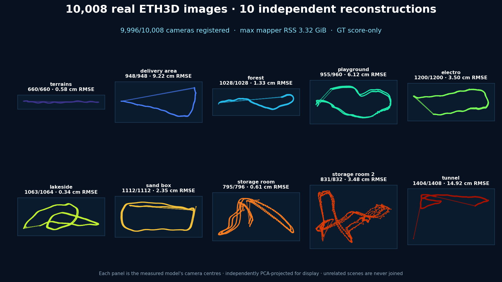
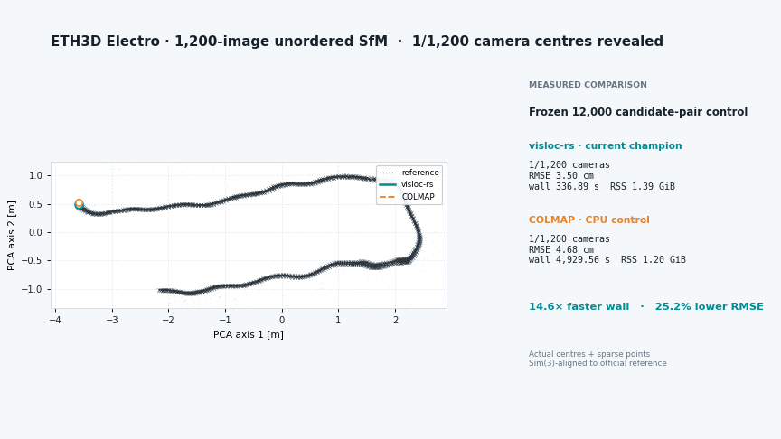
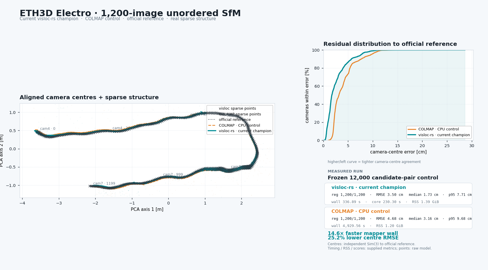
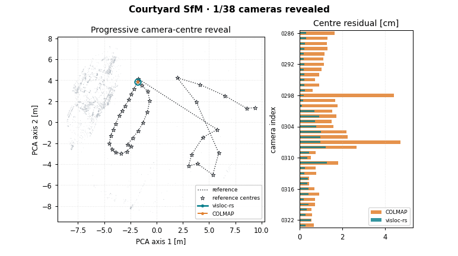
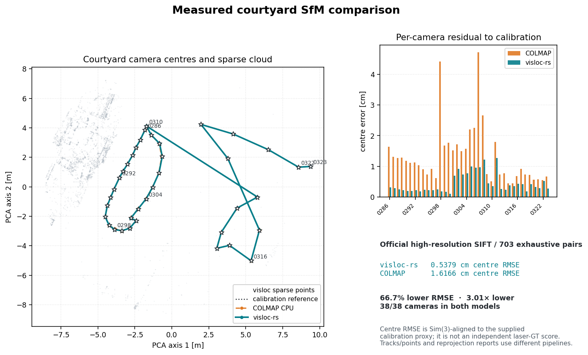

<h1 align="center">visloc-rs</h1>

<p align="center">
  <strong>GPS-denied visual localization, VO/SfM, and SLAM building blocks for robots and UAVs &mdash; in pure Rust.</strong>
</p>

<p align="center">
  <a href="https://github.com/rsasaki0109/visloc-rs/actions/workflows/ci.yml"></a>
  
  
  
</p>

## Measured at a glance

| Real-data result | visloc-rs | COLMAP 3.9.1 CPU | Outcome |
| --- | ---: | ---: | ---: |
| ETH3D Electro 1,200, same-input CPU8 end to end | **27:29** | 1:35:05 | **3.46× faster** |
| ETH3D Electro registered cameras | **1200/1200** | **1200/1200** | parity |
| ETH3D Electro camera-centre RMSE | **3.50 cm** | 4.68 cm | **25.2% lower** |
| ETH3D Courtyard camera-centre RMSE | **0.5379 cm** | 1.6166 cm | **66.7% lower** |

The comparisons use real images and measured runs; the detailed sections below
state where inputs or accounting differ. Separately, on the connected
OpenLORIS 10k stress set, streamed VLAD + LSH cuts visloc-rs candidate
generation from 49:49 to **8:51 (5.63×)**. That is a visloc retrieval A/B,
not an end-to-end COLMAP comparison. The frozen measurements
and output hashes are in
[`m6-ann-streaming.json`](benchmarks/electro/m6-ann-streaming.json).

Separately, the [Visual-Inertial SLAM (Basalt Rust port)](#visual-inertial-slam-basalt-rust-port)
— a distinct, tightly-coupled stereo-inertial VIO stack, not the vision-only
SfM/SLAM pipeline above — matches native Basalt's ATE to **within 0.1%** on
every one of the 11 EuRoC sequences at seed 7, with **0.563×** native's peak
RSS on the same-domain Linux runtime/RSS gate (1.133× runtime ratio). With
EuRoC's official calibration and its offline mapper stage, the same estimator
**beats measured ORB-SLAM3 (full-trajectory SE(3) ATE) on 8 of 11 EuRoC
sequences**, same evaluator, one run each.

**OpenLORIS 10k — calibrated-rig quality comparison:** visloc's experimental
observation-backed atlas preserves the connected frame counts and meets the
p95 target, but **RMSE parity is still open**.

| Metric | Frozen COLMAP control | visloc-rs experimental atlas | Target |
| --- | ---: | ---: | --- |
| Registered images | 9,998 / 10,000 | 9,998 / 10,000 | Met |
| Supported rig frames | 4,999 | 4,999 | Met |
| ATE RMSE ↓ | **0.3843 m** | 0.3890 m | **Not met** |
| ATE p95 ↓ | 0.6387 m | **0.6382 m** | Met |
| Observation-weighted mean reprojection ↓ | 0.9030 px | **0.5817 px** | Met |

The first continuous, generated-artifact native diagnostic also completed all
17 stages inside a 2 GiB cgroup:

| OpenLORIS 10k diagnostic | Frozen COLMAP control | visloc-rs | Outcome |
| --- | ---: | ---: | ---: |
| Mapper wall ↓ | 4:37:44 | **13:36** | **20.41× faster** |
| Measured generated phases ↓ | 5:20:57 | **4:43:26** | **1.13× faster** |
| Peak process / sampled RSS ↓ | 2.08 GiB | **1.72 GiB** | **17.0% lower** |
| OOM kills | 0 | 0 | parity |

Both models contain connected 4,494-frame and 505-frame components. Lower
reprojection error is not proof of better trajectory accuracy. ATE uses one
Sim(3) alignment per component; RMSE and p95 are computed from the pooled
GT-scored image errors, not averages of component scores. This is a
repeated development-sequence evaluation, not held-out validation, and no
10k speed win at equivalent quality is claimed. The visloc timing is one
uninterrupted run, but OS cache state was uncontrolled; the COLMAP total is a
sum of measured phases rather than one continuous cold wall clock. Repeated
cold-cache acceptance therefore remains open. See the
[frozen COLMAP control](benchmarks/electro/m8-openloris-colmap-10k-control.json)
and [native E2E evidence](benchmarks/electro/m8-native-e2e-v1.json), plus the
[experimental refinement evidence](benchmarks/electro/m8-openloris-atlas-connected-filtered-ba-v1.json).

## 10,008-image real-world SfM scale validation

<p align="center">
  
</p>

**visloc-rs registers 9,996/10,008 cameras (99.88%) across every ETH3D
low-resolution many-view scene, with no mapper run exceeding 3.32 GiB.** Each
panel above is drawn from the completed model's real camera centres. The ten
unrelated scenes remain ten independent reconstructions; supplied poses are
opened only after a model has been selected and written.

| Real scene | Registered / supplied | Centre RMSE | RMSE / extent | Mapper peak RSS |
| --- | ---: | ---: | ---: | ---: |
| terrains | **660/660** | 0.58 cm | 0.12% | 1.56 GiB |
| delivery area | **948/948** | 9.22 cm | 0.99% | 2.31 GiB |
| forest | **1028/1028** | 1.33 cm | 0.19% | 2.65 GiB |
| playground | **955/960** | 6.12 cm | 2.52% | 2.44 GiB |
| electro | **1200/1200** | 3.50 cm | 0.55% | 1.39 GiB |
| lakeside | **1063/1064** | 0.34 cm | 0.08% | 3.19 GiB |
| sand box | **1112/1112** | 2.35 cm | 0.45% | **3.32 GiB** |
| storage room | **795/796** | 0.61 cm | 0.42% | 1.71 GiB |
| storage room 2 | **831/832** | 3.48 cm | 2.57% | 1.00 GiB |
| tunnel | **1404/1408** | 14.92 cm | 1.61% | 3.25 GiB |

<p align="center"><sub>playground stages 955/960 supplied images after five
hash-audited source outliers are excluded. storage_room_2 advances from seed 1
(2/832) to seed 16 solely by internal registration count, before scoring.
tunnel RMSE includes one 5.32 m outlier; its median is 2.47 cm and p95 is
9.41 cm. Full precision, hashes, and selection notes:
<a href="benchmarks/electro/m5-eth3d-scale-validation.json">M5 evidence</a> ·
<a href="docs/electro_m5_scale_validation.md">scale report</a>.</sub></p>

<p align="center">
  <a href="docs/assets/eth3d_10008_scale_validation.png"></a><br>
  <sub>Full-resolution measured still · each trajectory is independently PCA-projected only for display.</sub>
</p>

## Same-input COLMAP speed comparison — Electro 1,200

<p align="center">
  
</p>

**visloc-rs completes the measured CPU8 pipeline 3.46× faster than COLMAP
while registering all 1,200 cameras with 25.2% lower centre RMSE.** The new
persistent matcher is itself 1.074× faster on the identical frozen 12,000-pair
manifest, and the memory-bounded mapper is 14.63× faster. Every accepted run
reproduces the same snapshot and model bytes.

| Same-input CPU8 phase / result | visloc-rs | COLMAP 3.9.1 CPU | Winner |
| --- | ---: | ---: | ---: |
| Feature extraction | 721.42 s | **304.12 s** | COLMAP 2.37× |
| Manifest validation + candidate generation/sharding | 148.58 s | frozen manifest supplied | — |
| Exact-pair matching + merge | **442.58 s** | 471.37 s | **visloc 1.06×** |
| Mapper / model writing | **336.90 s** | 4,929.56 s | **visloc 14.63×** |
| Conservative end-to-end wall | **1,649.48 s** | 5,705.05 s | **visloc 3.46×** |
| Matching peak RSS | 1.89 GiB | **0.26 GiB** | COLMAP |
| Mapper peak RSS | 1.39 GiB | **1.20 GiB** | COLMAP |
| Registered cameras | **1200/1200** | **1200/1200** | parity |
| Camera-centre RMSE | **3.50 cm** | 4.68 cm | **visloc −25.2%** |
| Reproducibility | exact snapshot ×3; exact model ×2 | frozen control | verified |

<p align="center"><sub>The camera-centre plot uses all 1,200 stems and Sim(3)
alignment to the supplied calibration proxy. Ground truth is score-only. The
visloc measurements use the same explicit 96-correspondence mapper cap, one
bounded post-refinement registration pass, four 8-iteration global solves, and
no follow-up global-refinement rounds; these controls are not global defaults.
The visloc total conservatively includes its candidate generation; COLMAP
consumes the already frozen identical candidate manifest. The two systems
extract and verify their own features/matches. The memory-bounded replay
re-reads one feature file at a time to validate the descriptor-bound snapshot
hash, then keeps keypoints only. Its 1,459,194 KiB median peak is 1.16× the
COLMAP mapper peak. See the
<a href="docs/electro_performance_roadmap.md">performance and memory roadmap</a>
and <a href="benchmarks/electro/quality-attribution.json">quality-attribution ledger</a>.</sub></p>
<p align="center"><sub>BA implementation and all nine A/B timings:
<a href="docs/electro_ba_block_system.md">direct-block Schur report</a>.</sub></p>
<p align="center"><sub>Quality-gated BA schedule audit and two-run hashes:
<a href="docs/electro_ba_schedule_audit.md">four-solve speed report</a>.</sub></p>
<p align="center"><sub>Descriptor-lifetime audit, two-run memory trace, and
exact-model proof: <a href="docs/electro_snapshot_memory_audit.md">1.39 GiB
snapshot replay report</a>.</sub></p>
<p align="center"><sub>Persistent worker, three-run matching median,
bounded merge, byte-identical feature re-extraction, and end-to-end ledger:
<a href="docs/electro_persistent_matcher_audit.md">3.46× CPU8 report</a>.</sub></p>

<p align="center">
  <a href="docs/assets/electro_1200_sfm_comparison.png"></a><br>
  <sub>Full-resolution measured still · camera centres are ordered by timestamp
  and camera; sparse points are a deterministic final-model sample.</sub>
</p>

### Connected 10,000-image corridor stress

The same restartable `7N` pipeline processes all 10,000 timestamp-ordered
OpenLORIS corridor inputs in **1:03:45** with a **1.78 GiB** peak. This passes
the resource gate, not the reconstruction-quality gate: registration is strong
at 1k, plateaus near 1.2k, then falls to 199 at the full tier. We report that
failure instead of presenting the run as a complete 10k map.

The opt-in streamed global-descriptor path now builds the same 70,000-pair
envelope in **8:51**, versus 49:49 for exact all-image ranking. At the frozen
1k quality gate, its scale-aware LSH schedule registers **991/1000** images,
versus 989/1000 for exact retrieval. The 10k mapping-quality failure below is
still open; faster retrieval does not by itself claim to solve it.

On the same frozen 10k verified snapshot, conflict-aware confidence ordering
raises registration from 199 to **3,664 cameras** while reducing mean
reprojection from 1.301 to **1.140 px**. It rejects only an edge whose merge
would put two observations from one image into a track; the remaining
1,192,223 observations stay available to mapping. This is an 18.4× recovery,
not a completed 10k reconstruction: 63.36% of the supplied cameras remain
unregistered. Frozen hashes and negative controls are in
[`m6-conflict-aware-tracks.json`](benchmarks/electro/m6-conflict-aware-tracks.json).

| Frozen 10k mapper replay | Registered | Mean reprojection | Mapping wall |
| --- | ---: | ---: | ---: |
| Legacy UnionFind | 199/10,000 | 1.301 px | **1:59.8** |
| Confidence-ordered tracks | **3,664/10,000** | **1.140 px** | 9:02.9 |
| Component models (7 independent gauges) | **6,791/10,000** | 0.928–1.293 px | 10:44.5 |

The component run explains the remaining gap: the frozen verified view graph
contains 313 connected components, with seven major components covering 9,682
images. Mapping those seven sequentially recovers 85.3% more cameras than the
single-model replay, and preserves the M6 model byte-for-byte for the largest
component. These are still seven coordinate systems, not one connected map;
verified bridge discovery and Sim(3) alignment are required before making that
claim. Evidence and model hashes are in
[`m7-component-models.json`](benchmarks/electro/m7-component-models.json).

| Connected tier | Candidate / verified pairs | Registered | Total wall | Peak phase RSS |
| --- | ---: | ---: | ---: | ---: |
| 1,000 | 7,000 / 6,869 | **989 (98.9%)** | 2:25 | 274 MiB |
| 2,500 | 17,500 / 16,321 | 1,223 (48.9%) | 7:10 | 392 MiB |
| 5,000 | 35,000 / 31,521 | 1,212 (24.2%) | 20:33 | 676 MiB |
| 10,000 | 70,000 / 58,879 | **199 (2.0%)** | 1:03:45 | **1.78 GiB** |

<p align="center"><sub>The 10k peak is its 2,188-shard streaming merge;
candidate generation peaks at 1.14 GiB, matching at 851 MiB, and compact
mapping at 501 MiB. Exact VLAD ranking still scores every image pair, so ANN
retrieval plus streamed global descriptors now removes that quadratic ranking
bottleneck. These historical M5 results predate the calibrated-rig
<a href="benchmarks/electro/m8-openloris-colmap-10k-control.json">M8 COLMAP control</a>
and are not a same-condition head-to-head comparison. Source/license, hashes, phase ledgers, and
honest dense/global negatives:
<a href="benchmarks/electro/m5-openloris-connected-scale-validation.json">connected M5 evidence</a> ·
<a href="docs/electro_m5_scale_validation.md">full scale report</a>.</sub></p>

### 300-image reliability gate

Before another 1,200-image tuning run, the resumable pipeline was killed,
restarted, corrupted, and repeated on a frozen 300-image probe. The bounded
K=64 schedule retained **99.871%** of exhaustive verified pairs and lost only
**0.667 percentage point** of registration; two complete runs reproduced the
same candidate, feature, snapshot, and COLMAP-model hashes.

| Measured probe result | Bounded K=64 | Exhaustive control |
| --- | ---: | ---: |
| Candidate / verified pairs | 10,634 / 3,878 | 44,850 / 3,883 |
| Verified-pair recall | **99.871%** | 100% |
| Registered cameras | 200/300 | 202/300 |
| Matching / mapper wall | 90.65 s / 75.97 s | 160.58 s / 90.38 s |
| Mapper peak RSS | **169.7 MiB** | 170.2 MiB |

<p align="center"><sub>Feature extraction was 630.76 s with 193.4 MiB peak
RSS; the full generated feature + run footprint was 318.8 MiB. Same-size
corruption is rejected and SIGKILL resume reproduces uninterrupted hashes. See the
<a href="benchmarks/electro/electro-300-phase-ledger.json">phase ledger</a>
and <a href="benchmarks/electro/electro-300-failure-injection.log">failure-injection record</a>.</sub></p>

## Measured courtyard SfM control

<p align="center">
  
</p>

**38/38 cameras registered at 0.5379 cm centre RMSE for visloc-rs, versus 1.6166 cm for official COLMAP CPU SIFT — 66.7% lower (3.01×).** Both results use the same 38 official high-resolution courtyard images, exhaustive 703-pair features/matches, and per-image PINHOLE calibration; only downstream verification/mapping differs.

| Metric | visloc-rs | Official COLMAP CPU |
| --- | ---: | ---: |
| Registered cameras | **38/38** | **38/38** |
| Sparse structure | 43,852 tracks / 152,432 observations | 38,422 points / 169,590 observations |
| Reported mean reprojection / point error | 0.579 px | 0.744758 px |
| Camera-centre RMSE after Sim(3) alignment | **0.5379 cm** | 1.6166 cm |

<p align="center"><sub>Lower centre RMSE is better. The plot is aligned to the supplied calibration proxy; tracks versus points and reprojection reports are not identical accounting schemes. <a href="#courtyard-control-details">Details, provenance, and reproduction</a>.</sub></p>

## Run the SfM demo

Build the example with the `image-io` feature. The unordered demo accepts a
directory of photos, estimates SIFT features in process, and writes a COLMAP
text model (`cameras.txt`, `images.txt`, and `points3D.txt`) to the path given
by `--out-colmap`. Supply either scalar intrinsics, as below, or a validated
per-image model with `--input-colmap-calibration`; datasets and calibration
files are external inputs and are not bundled with this repository.

```bash
cargo run --release --example unordered_sfm_demo --features image-io -- \
  --feature-extractor sift \
  --images-dir /path/to/my_photos \
  --width 1920 --height 1080 --fx 1400 --fy 1400 --cx 960 --cy 540 \
  --sift-max-keypoints 4096 \
  --retrieval-topk 12 --min-matches 30 --match-ratio 0.8 \
  --verification-mode full --mapper incremental \
  --next-image-policy auto --post-refinement-registration \
  --final-iterative-refinement \
  --out-colmap /path/to/runs/my-photos-sfm
```

For the measured courtyard control, keep the artifact, image, and calibration
paths explicit. `--verify-only` is fast and read-only; `--full` starts a fresh
mapping run and writes its JSON summary/model under `--output-dir`.

```bash
ARTIFACT_ROOT=/path/to/colmap_highres_exhaustive_allpairs_20260830
IMAGES_DIR=/path/to/dslr_images_undistorted
CALIBRATION_MODEL=/path/to/dslr_calibration_undistorted

scripts/benchmark_courtyard.sh --verify-only \
  --artifact-root "$ARTIFACT_ROOT" \
  --images-dir "$IMAGES_DIR" \
  --calibration-model "$CALIBRATION_MODEL" \
  --colmap-control validate --visuals check

scripts/benchmark_courtyard.sh --full --no-build \
  --artifact-root "$ARTIFACT_ROOT" \
  --images-dir "$IMAGES_DIR" \
  --calibration-model "$CALIBRATION_MODEL" \
  --output-dir /path/to/runs/courtyard-sfm \
  --colmap-control validate --visuals skip
```

The example header documents the complete unordered-SfM option set; the
[courtyard benchmark guide](docs/courtyard_benchmark.md) documents artifact
validation, candidate schedules, and reproducible large-run details.

For a disconnected verified snapshot, add
`--component-model-min-images 100 --component-model-max-count 7` to write
bounded, size-ranked independent models below `--out-colmap`, plus a
`components.tsv` manifest. The mode is explicit because its outputs have
independent gauges and must not be mistaken for one connected reconstruction.

<p align="center">
  <br>
  <sub>Online stereo SLAM on EuRoC MH_01 — onboard camera and the live map growing in real time: uninterrupted tracking throughout the shown 583-frame measured segment (100% coverage, 0.344 m rigid ATE RMSE), with the landmark map grown by stereo landmark replenishment. Still version: <a href="docs/assets/hero_euroc_mh01_light.png">light</a> · <a href="docs/assets/hero_euroc_mh01_dark.png">dark</a>.</sub>
</p>

## Visual-Inertial SLAM (Basalt Rust port)

This is a separate, faithful Rust port of upstream
[Basalt](https://github.com/VladyslavUsenko/basalt) commit `0f3b2b52` — a
tightly-coupled stereo-inertial VIO estimator plus an offline structure-from-motion
mapper — living in [`pipelines/basalt`](pipelines/basalt) and exercised end to
end by [`examples/basalt_euroc_vio_demo.rs`](examples/basalt_euroc_vio_demo.rs).
It is not the vision-only stereo SLAM stack used in the SfM/SLAM sections above:
Basalt fuses IMU preintegration directly into the sliding-window optimizer, and
this port targets upstream numerical and structural fidelity (matching Basalt's
own frontend, factors, and marginalization) on the standard EuRoC benchmark,
not a from-scratch design.

<p align="center">
  
</p>

<p align="center"><sub>Six of the eight EuRoC sequences where this
repository's Basalt VIO + offline mapper (blue) beats measured ORB-SLAM3
(red), both SE(3)-Umeyama-aligned to EuRoC ground truth (black). Full
results and protocol below.</sub></p>

### Beating ORB-SLAM3 on EuRoC

Same evaluator, one run per sequence, full-trajectory ATE with SE(3) Umeyama
alignment; ORB-SLAM3 measured on this machine (not a paper number). Both
systems use EuRoC's official per-sequence calibration — ORB-SLAM3 always did;
this repository switches its Basalt VIO's input calibration to match (see
"How this works" below). Estimator code is otherwise unchanged from the
faithful-port parity result linked at the end of this section.

| Sequence | visloc-rs (Basalt port + offline mapper) | ORB-SLAM3 stereo-inertial | Winner |
| --- | ---: | ---: | :---: |
| MH_01_easy | 0.015 | 0.036 | visloc-rs |
| MH_02_easy | 0.024 | 0.033 | visloc-rs |
| MH_03_medium | 0.026 | 0.028 | visloc-rs |
| MH_04_difficult | 0.085 | 0.043 | ORB-SLAM3 |
| MH_05_difficult | 0.061 | 0.055 | ORB-SLAM3 |
| V1_01_easy | 0.035 | 0.038 | visloc-rs |
| V1_02_medium | 0.014 | 0.017 | visloc-rs |
| V1_03_difficult | 0.018 | 0.029 | visloc-rs |
| V2_01_easy | 0.016 | 0.039 | visloc-rs |
| V2_02_medium | 0.010 | 0.014 | visloc-rs |
| V2_03_difficult | 0.065 | 0.056 | ORB-SLAM3 |

<p align="center"><sub>8/11 wins. All values are full-trajectory ATE
translation RMSE in metres, lower is better. V2_02_medium's number is from a
manual detached rerun of exactly the same command as the other sequences:
the driver's own attempt for this one sequence was killed by its wall-time
safety monitor
(<code>E:\visloc-rs-runs\basalt_official_calib_20260915\status\V2_02_medium.failed.json</code>,
a host/disk artefact of that specific run, not a tracking or optimizer
failure) before it could finish and write a result; the rerun completed
normally. VIO alone, before the offline mapper runs, already beats
ORB-SLAM3 on MH_01_easy (0.030 vs 0.036 m) and V2_01_easy (0.027 vs
0.039 m).</sub></p>

<p align="center">
  
</p>

**How this works.** Basalt's shipped calibration is its own from-scratch DS
recalibration of EuRoC's raw images, not EuRoC's official factory pinhole
calibration (`mav0/cam{0,1}/sensor.yaml`) that ORB-SLAM3 uses — and it
carries a ~1.4% metric-scale bias, isolated by a visual-side sensitivity
probe (not IMU noise, which was tested and ruled out) to the stereo
calibration itself (~+0.45% effective focal length, ~+0.15% baseline vs the
official calibration).
[`scripts/euroc_official_to_ds_calib.py`](scripts/euroc_official_to_ds_calib.py)
converts EuRoC's official calibration directly into Basalt's DS model
(GT-free; see
[`configs/basalt/variants/official_euroc_ds/README.txt`](configs/basalt/variants/official_euroc_ds/README.txt)
for the fit-region rationale), which removes most of the bias; the
unchanged faithful NFR offline mapper then closes loops and optimises
globally on top of the corrected VIO output. Full root-cause diagnostics
(E1/E2 visual-vs-IMU decomposition, IMU-noise negative controls) are in
[the plan doc](docs/vi_slam_global_consistency_plan.md).

Two things this result is **not**: (a) the estimator/mapper code is
unchanged — this is a calibration-input fix plus an existing offline stage,
not a new algorithm; (b) the mapper is an offline batch stage, not a
real-time one — 2-18 minutes and 3-6 GB peak RSS per sequence
(`E:\visloc-rs-runs\basalt_mapper_all11_20260915\summary.md`, the run
artifact these per-sequence costs are quoted from), so the 29 MB / real-time
VIO-only footprint noted at the end of this section does not apply to the
mapper number in this table. The three losses (MH_04, MH_05, V2_03) are VIO
tracking-robustness limits on fast/motion-blurred/dark sequences, not
mapper or calibration limits — see
[`docs/vi_slam_global_consistency_plan.md`](docs/vi_slam_global_consistency_plan.md)
for next steps.

### Pipeline

```mermaid
flowchart LR
    IMG["Stereo cam0 / cam1 PNGs<br/>euroc.rs"] --> PYR["Basalt image pyramid<br/>pyramid.rs"]
    PYR --> FAST["FAST-9 grid detector<br/>fast.rs"]
    FAST --> OF["Frame-to-frame optical flow<br/>Pattern51 patches<br/>stream.rs / patch.rs / pattern.rs"]
    OF --> EPI["Stereo epipolar filter<br/>adapter.rs"]
    IMU["IMU samples"] --> PRE["IMU preintegration<br/>imu/preintegration.rs, imu/sampling.rs"]
    EPI --> INIT["Initialization<br/>initialization.rs"]
    PRE --> INIT
    INIT --> LM["ABS_QR LM sliding window + FEJ<br/>vio/estimator.rs, vio/window.rs, vio/aom.rs"]
    LM --> MARG["Square-root marginalization<br/>vio/margdata.rs"]
    MARG --> OUT["Trajectory (TUM / CSV) + MargData packets<br/>adapter.rs"]
    OUT --> MAP["Offline mapper<br/>mapper/mod.rs, mapper/session.rs"]
    MAP --> MATCH["Keyframe matching + 5-pt Stewenius RANSAC<br/>mapper/features.rs"]
    MATCH --> TRI["Triangulation + bundle adjustment<br/>mapper/triangulation.rs"]
    TRI --> PTS["map.json / points.json / poses.json"]
```



<p align="center"><sub>Node labels are the actual source modules under
<a href="pipelines/basalt/src">pipelines/basalt/src</a>. Marginalization
(<code>sqrt_to_sqrt_marginalize</code> in <code>vio/margdata.rs</code>) runs
every frame; a MargData packet is only written to disk when Basalt selects a
keyframe for removal, which is what feeds the offline mapper.</sub></p>

### Run it

Build with AVX2/FMA and the LM-workspace-reuse optimization used for the
measurements above:

```bash
RUSTFLAGS="-C target-feature=+avx2,+fma" \
  cargo build --release --example basalt_euroc_vio_demo --features basalt-lm-workspace-reuse
```

Then replay one EuRoC sequence (`--calibration` and `--config` below are
checked into this repository; `--euroc-dir` is an external dataset path):

```bash
cargo run --release --example basalt_euroc_vio_demo --features basalt-lm-workspace-reuse -- \
  --euroc-dir /path/to/MH_01_easy \
  --calibration benchmarks/basalt/release_inputs/euroc_ds_calib.json \
  --config configs/basalt/euroc_config.json \
  --out-dir target/basalt_mh01 \
  --max-frames 80
```

This writes `trajectory.tum`, `trajectory.csv`, `trace.jsonl`, a
`marg_data/` directory of per-keyframe MargData JSON packets (the offline
mapper's input), and `summary.txt` under `--out-dir`. Pass `--no-trace`
and/or `--no-marg-data` to drop the diagnostic trace and MargData output
respectively; `--help` lists every flag. The example never reads a ground-truth
file — all outputs are produced causally from sensor data and estimator state.

To reproduce the "official calibration + mapper" result above instead, swap
in the official-calibration variant (keep `--no-marg-data` off, since the
mapper needs it) and then run the offline mapper on the resulting
`marg_data/` directory:

```bash
cargo run --release --example basalt_euroc_vio_demo --features basalt-lm-workspace-reuse -- \
  --euroc-dir /path/to/MH_01_easy \
  --calibration configs/basalt/variants/official_euroc_ds/euroc_ds_calib.json \
  --config configs/basalt/variants/official_euroc_ds/euroc_config.json \
  --out-dir target/basalt_mh01_official

cargo run --release --example basalt_mapper_offline_demo -- \
  --marg-dir target/basalt_mh01_official/marg_data \
  --calibration configs/basalt/variants/official_euroc_ds/euroc_ds_calib.json \
  --config configs/basalt/variants/official_euroc_ds/euroc_config.json \
  --out-dir target/basalt_mh01_official_mapper
```

`configs/basalt/variants/official_euroc_ds/euroc_ds_calib.json` is produced
from EuRoC's own factory pinhole-radtan calibration by
[`scripts/euroc_official_to_ds_calib.py`](scripts/euroc_official_to_ds_calib.py)
(GT-free; see its
[README](configs/basalt/variants/official_euroc_ds/README.txt) for the fit
decision). The mapper writes `trajectory.tum`/`trajectory.csv` (keyframe
poses) plus `poses.json`/`points.json`/`map.json`/`mapper_report.json`; to
propagate the mapper's corrections onto the full (non-keyframe) VIO
trajectory for scoring, run
[`scripts/propagate_basalt_mapper_corrections.py`](scripts/propagate_basalt_mapper_corrections.py):

```bash
python3 scripts/propagate_basalt_mapper_corrections.py \
  --vio-trajectory-csv target/basalt_mh01_official/trajectory.csv \
  --mapper-poses-json target/basalt_mh01_official_mapper/poses.json \
  --out-tum target/basalt_mh01_official_mapper/full_trajectory.tum
```

`scripts/run_basalt_official_calib_all11.py` drives all three steps above
plus evaluation across all 11 EuRoC sequences (detached, resumable, writes a
live-updating `summary.md`/`summary.json`); see its module docstring.

### Honest caveats

- The offline mapper matches native's match graph exactly but its final point
  coordinates are only verified within 1 mm of native, not bit-exact.
- The mapper is an offline batch stage (2-18 minutes, 3-6 GB peak RSS per
  sequence), not real-time; only the VIO stage is (29 MB peak RSS, see the
  faithful-port parity pointer below).
- MH_04, MH_05, and V2_03 remain losses vs ORB-SLAM3: these are VIO
  tracking-robustness limits on fast/motion-blurred/dark sequences, not
  calibration or mapper limits — see
  [the plan doc](docs/vi_slam_global_consistency_plan.md) for next steps.
- V2_02_medium's mapper number above is from a manual rerun after the
  automated all-11 sweep's own attempt for that sequence hit a driver
  wall-time-monitor artefact (see the headline table's caption).
- The Cargo license inventory resolves 119/119 package licenses, but legal
  clearance was not sought or claimed — this is an engineering audit, not a
  legal one.

Separately, on upstream Basalt's own shipped calibration/config inputs (not
the official-calibration result above), the Rust port matches native
Basalt's ATE to within **0.1%** on all 11 EuRoC sequences and is byte-exact
cross-target (Windows ↔ Linux) at the trajectory/lifecycle level, with
**1.13×** runtime and **0.56×** peak RSS vs native on the same-domain Linux
measurement — this is the separate faithful-port parity claim; see the
[faithful-port closure report](work/m11_basalt_faithful_port_final_closure_20260914.md)
and [upstream oracle / provenance](benchmarks/basalt/README.md) for the full
parity evidence.

## Quickstart

Requires Rust 1.83+.

```bash
cargo build
cargo run --example localize_dummy
```

## Verified results

Local public-data development measurements, not official leaderboard submissions.
The headline snapshot is registry-backed by
[`benchmarks/registry/readme_claims_v1.json`](benchmarks/registry/readme_claims_v1.json);
see the [registered run evidence](docs/generated/registered_runs.md) and
[scoped claim matrix](docs/generated/benchmark_claim_matrix.md).

- **KITTI multi-sequence published-baseline comparison** — one uniform full-stack config over 00/02/05/06/07/09; narrow published-baseline wins on seq00 (**1.23 m vs ORB-SLAM2 1.3 m**) and seq09 (**2.07 m vs ORB-SLAM2 3.2 m**), with seq00/05/06 in the OV2SLAM-RT accuracy band. This is not a leaderboard or ORB-SLAM3 claim; the run also records real-world frontend failure-mode fixes.
- **EuRoC MH_03 / MH_05 full pipeline** — stereo visual loop-closure + BA on MH_03 / MH_05: **0.057 m / 0.072 m** ATE. The claim matrix marks ORB-SLAM3 comparisons as behind (**~2.4x / ~1.4x**), OV2SLAM as near, and VINS-Fusion stereo as a stereo-only win; this is not a tight-VIO claim.
- **TUM RGB-D fr1_xyz / fr1_desk** — indoor handheld via **virtual stereo** (depth as a synthetic right image, zero backend changes): **0.014 m / 0.026 m** ATE, compared against published ORB-SLAM2 RGB-D ranges in the claim matrix; loop closure is a **6x** lever on the revisit-heavy desk.
- **Sequential SfM vs COLMAP (metric video)** — same 2700-frame EuRoC flight, same evo scoring: visloc stereo VO + loop SfM **6 min, 0.13 m** (trajectory 0.066 m, metric) vs COLMAP mono incremental **11.7 h, 2.18 m** (scale-free) - **~117x faster, ~17-33x more accurate, metric scale**. (Stereo-vs-mono: the win is the metric-video regime, not COLMAP's unordered-photo home turf.)
- **Unordered SfM (real photo collections)** — Orderless monocular photos -> VLAD view graph -> incremental reconstruction (robust multi-seed init, P3P register, scale-gauge-fixed BA, iterative track filter), vs **COLMAP's own model** with an independent SuperPoint frontend: **COLMAP South Building** (128 photos) **128/128 reg, 1.09 cm**; **Gerrard Hall** (100 photos, 5616x3744 OPENCV) **98/100, 0.68 cm** (3/100 single-seed) - both **0.1 % of extent**. EuRoC V2_03 orbit **31/31, 1.08 cm**

### Courtyard control details

The central apples-to-apples control uses the same 38 official high-resolution
courtyard images, official CPU-SIFT features, exhaustive 703-pair raw matches,
and per-image PINHOLE calibration. The downstream verification/mapping
implementation differs; no features are re-extracted. Camera centres in the
plot are independently Sim(3)-aligned to the supplied
calibration model, so both trajectories share one frame and scale.



The centre RMSE is lower by **66.7% (3.01×)** for this measured control;
lower is better. “Tracks” versus “points” and the two reprojection reports are
not claimed to be identical accounting schemes. The centre reference is the
supplied ETH3D calibration proxy, not an independent laser-camera ground-truth
archive. Reproduction details, hashes, and the exact COLMAP 4.2 CPU commands
are in [`docs/colmap_highres_exhaustive_audit_20260830.md`](docs/colmap_highres_exhaustive_audit_20260830.md)
and [`docs/reproducibility_ci_closure_20260830.md`](docs/reproducibility_ci_closure_20260830.md).
The committed visuals can be regenerated with
[`scripts/generate_courtyard_readme_visuals.py`](scripts/generate_courtyard_readme_visuals.py)
(`numpy`, `matplotlib`, and `Pillow` are optional asset-generation dependencies):

```bash
python3 scripts/generate_courtyard_readme_visuals.py \
  --visloc-model <visloc_model> \
  --colmap-model <colmap_model> \
  --reference-model <calibration_model> \
  --output-dir docs/assets
```

For a hash-checked, one-command validation or fresh rerun of this control, see
[`docs/courtyard_benchmark.md`](docs/courtyard_benchmark.md) and run
[`scripts/benchmark_courtyard.sh`](scripts/benchmark_courtyard.sh). Large
dataset-derived artifacts remain external to the repository.

Secondary frozen-cache measurements are kept separate from that central
control:

| Suite | Current measured result | Provenance / caveat |
| --- | --- | --- |
| South Building | **128/128**, 1.406 px, 0.73 cm | Demo no-flag `Auto`; frozen cache and calibration-proxy score |
| ETH3D terrace | **23/23**, 1.574 px, 2.56 cm | Current frozen cache; historical 12.37 cm feature cache is unavailable |
| ETH3D office | **18/26**, 1.512 px, 0.45 cm | Auto adds one camera and lowers reprojection; reference RMSE is 0.43→0.45 cm vs Count, so no accuracy gain is claimed; historical cache unavailable |
| EuRoC MH_03 | **2,700/2,700** poses; ATE Sim(3) 2.1740 m (open), 0.4393 m (loop), 0.0843 m (full), 0.0537 m (full2vhi) | Same-cache baseline/current non-regression pass under one fixed `max(5%, 5 mm)` rule; this runner has no Auto policy |

See the [current handover](docs/codex_handover.md) and [full non-regression
record](docs/nonregression_20260830.md) for exact commands, artifacts, and
classification of unavailable historical caches.

## Documentation

The [detailed README material](docs/readme_details.md) preserves the project
boundaries, feature overview, full demos table, minimal Rust example, repository
layout, roadmap, further-reading index, and complete benchmark snapshot that
previously lived here.

- **Choose and run a demo:** [demo index](docs/demo_strategy.md), [public COLMAP map-reuse demo](docs/public_data_demo.md), [GNSS-prior tracking](docs/gnss_demo.md), and [interactive KITTI trajectory viewer](https://rsasaki0109.github.io/visloc-rs/kitti3d/).
- **Understand supported configurations:** [feature matrix](docs/feature_matrix.md), [API stability](docs/api_stability.md), [COLMAP compatibility](docs/colmap_compatibility.md), and [migration notes](docs/migration.md).
- **Inspect VO and loop-closure evidence:** [KITTI multi-sequence](docs/kitti_multiseq_benchmark.md), [KITTI loop closure](docs/kitti_loop_closure_benchmark.md), [EuRoC loop closure](docs/euroc_loop_closure_benchmark.md), [TUM RGB-D](docs/tum_rgbd_benchmark.md), and [tracking persistence](docs/tracking_persistence_benchmark.md).
- **Inspect VI-SLAM (Basalt Rust port) evidence:** [faithful-port final closure report](work/m11_basalt_faithful_port_final_closure_20260914.md) and [upstream oracle / provenance](benchmarks/basalt/README.md).
- **Where VI-SLAM goes next:** [global-consistency plan](docs/vi_slam_global_consistency_plan.md) — same-protocol ORB-SLAM3 measurements, the 8/11 official-calibration + mapper result and its scale-bias root cause, the paused persistent-map prototype, and the staged plan targeting VIO tracking robustness on the three remaining losses.
- **Inspect SfM evidence:** [EuRoC reconstruction](docs/euroc_sfm_benchmark.md), [sequential SfM vs COLMAP](docs/sfm_vs_colmap_benchmark.md), [unordered SfM](docs/unordered_sfm_benchmark.md), and [registry evidence for the head-to-head](docs/generated/sfm_vs_colmap_headtohead.md).
- **Inspect learned frontend evidence:** [SuperPoint ONNX/CUDA](docs/superpoint_onnx_cuda_benchmark.md), [LightGlue ONNX](docs/lightglue_onnx_benchmark.md), and [single-binary deep stereo SLAM](docs/inprocess_slam_benchmark.md).
- **Inspect mapping and optimization evidence:** [learned retrieval for relocalization](docs/learned_retrieval_relocalization.md), [multi-session lifelong mapping](docs/multi_session_lifelong_benchmark.md), and [pose-graph / BA internals with GTSAM parity](docs/pgo_internals.md).
- **Follow the project:** [roadmap](docs/roadmap.md), [contributing](CONTRIBUTING.md), [security](SECURITY.md), and [changelog](CHANGELOG.md).

## License

Licensed under either of [Apache License, Version 2.0](LICENSE-APACHE) or
[MIT license](LICENSE-MIT), at your option.
