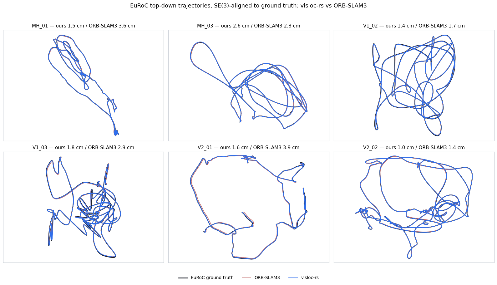
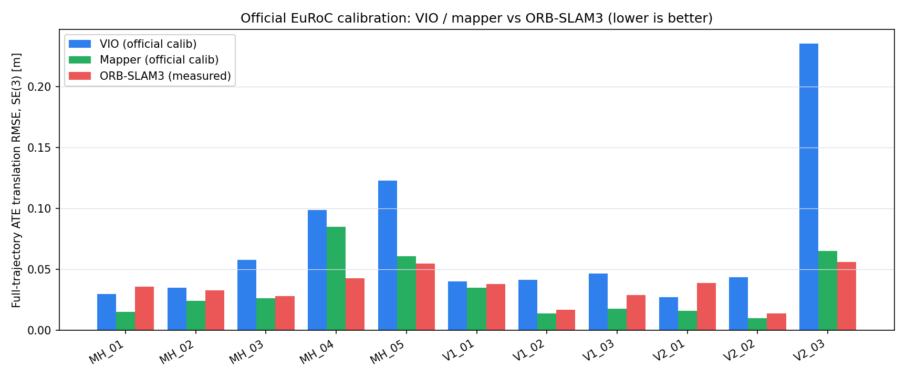

# Visual-Inertial SLAM (Basalt Rust port) — benchmark details

This page preserves the detailed VI-SLAM measurements relocated from the
[README](../README.md) front page. The estimator is a separate, faithful Rust
port of upstream [Basalt](https://github.com/VladyslavUsenko/basalt) commit
`0f3b2b52` — a tightly-coupled stereo-inertial VIO estimator plus an offline
structure-from-motion mapper — living in [`pipelines/basalt`](../pipelines/basalt)
and exercised end to end by
[`examples/basalt_euroc_vio_demo.rs`](../examples/basalt_euroc_vio_demo.rs).
It is not the vision-only stereo SLAM stack used in the SfM sections: Basalt
fuses IMU preintegration directly into the sliding-window optimizer, and this
port targets upstream numerical and structural fidelity (matching Basalt's own
frontend, factors, and marginalization) on the standard EuRoC benchmark, not a
from-scratch design.

<p align="center">
  
</p>

<p align="center"><sub>Six of the eight EuRoC sequences where this
repository's Basalt VIO + offline mapper (blue) beats measured ORB-SLAM3
(red), both SE(3)-Umeyama-aligned to EuRoC ground truth (black). Full
results and protocol below.</sub></p>

## Beating ORB-SLAM3 on EuRoC

Same evaluator, one run per sequence, full-trajectory ATE with SE(3) Umeyama
alignment; ORB-SLAM3 measured on this machine (not a paper number). Both
systems use EuRoC's official per-sequence calibration — ORB-SLAM3 always did;
this repository switches its Basalt VIO's input calibration to match (see
"How this works" below). Estimator code is otherwise unchanged from the
faithful-port parity result linked at the end of this section.

| Sequence | visloc-rs (Basalt port + offline mapper) | ORB-SLAM3 stereo-inertial | Winner |
| --- | ---: | ---: | :---: |
| MH_01_easy | 0.015 | 0.036 | visloc-rs |
| MH_02_easy | 0.024 | 0.033 | visloc-rs |
| MH_03_medium | 0.026 | 0.028 | visloc-rs |
| MH_04_difficult | 0.085 | 0.043 | ORB-SLAM3 |
| MH_05_difficult | 0.061 | 0.055 | ORB-SLAM3 |
| V1_01_easy | 0.035 | 0.038 | visloc-rs |
| V1_02_medium | 0.014 | 0.017 | visloc-rs |
| V1_03_difficult | 0.018 | 0.029 | visloc-rs |
| V2_01_easy | 0.016 | 0.039 | visloc-rs |
| V2_02_medium | 0.010 | 0.014 | visloc-rs |
| V2_03_difficult | 0.065 | 0.056 | ORB-SLAM3 |

<p align="center"><sub>8/11 wins. All values are full-trajectory ATE
translation RMSE in metres, lower is better. V2_02_medium's number is from a
manual detached rerun of exactly the same command as the other sequences:
the driver's own attempt for this one sequence was killed by its wall-time
safety monitor
(<code>E:\visloc-rs-runs\basalt_official_calib_20260915\status\V2_02_medium.failed.json</code>,
a host/disk artefact of that specific run, not a tracking or optimizer
failure) before it could finish and write a result; the rerun completed
normally. VIO alone, before the offline mapper runs, already beats
ORB-SLAM3 on MH_01_easy (0.030 vs 0.036 m) and V2_01_easy (0.027 vs
0.039 m).</sub></p>

<p align="center">
  
</p>

**How this works.** Basalt's shipped calibration is its own from-scratch DS
recalibration of EuRoC's raw images, not EuRoC's official factory pinhole
calibration (`mav0/cam{0,1}/sensor.yaml`) that ORB-SLAM3 uses — and it
carries a ~1.4% metric-scale bias, isolated by a visual-side sensitivity
probe (not IMU noise, which was tested and ruled out) to the stereo
calibration itself (~+0.45% effective focal length, ~+0.15% baseline vs the
official calibration).
[`euroc_official_to_ds_calib.py`](../scripts/euroc_official_to_ds_calib.py)
converts EuRoC's official calibration directly into Basalt's DS model
(GT-free; see
[`configs/basalt/variants/official_euroc_ds/README.txt`](../configs/basalt/variants/official_euroc_ds/README.txt)
for the fit-region rationale), which removes most of the bias; the
unchanged faithful NFR offline mapper then closes loops and optimises
globally on top of the corrected VIO output. Full root-cause diagnostics
(E1/E2 visual-vs-IMU decomposition, IMU-noise negative controls) are in
[the plan doc](vi_slam_global_consistency_plan.md).

Two things this result is **not**: (a) the estimator/mapper code is
unchanged — this is a calibration-input fix plus an existing offline stage,
not a new algorithm; (b) the mapper is an offline batch stage, not a
real-time one — 2-18 minutes and 3-6 GB peak RSS per sequence
(`E:\visloc-rs-runs\basalt_mapper_all11_20260915\summary.md`, the run
artifact these per-sequence costs are quoted from), so the 29 MB / real-time
VIO-only footprint noted at the end of this section does not apply to the
mapper number in this table. The three losses (MH_04, MH_05, V2_03) are VIO
tracking-robustness limits on fast/motion-blurred/dark sequences, not
mapper or calibration limits — see
[`vi_slam_global_consistency_plan.md`](vi_slam_global_consistency_plan.md)
for next steps.

## Pipeline

```mermaid
flowchart LR
    IMG["Stereo cam0 / cam1 PNGs<br/>euroc.rs"] --> PYR["Basalt image pyramid<br/>pyramid.rs"]
    PYR --> FAST["FAST-9 grid detector<br/>fast.rs"]
    FAST --> OF["Frame-to-frame optical flow<br/>Pattern51 patches<br/>stream.rs / patch.rs / pattern.rs"]
    OF --> EPI["Stereo epipolar filter<br/>adapter.rs"]
    IMU["IMU samples"] --> PRE["IMU preintegration<br/>imu/preintegration.rs, imu/sampling.rs"]
    EPI --> INIT["Initialization<br/>initialization.rs"]
    PRE --> INIT
    INIT --> LM["ABS_QR LM sliding window + FEJ<br/>vio/estimator.rs, vio/window.rs, vio/aom.rs"]
    LM --> MARG["Square-root marginalization<br/>vio/margdata.rs"]
    MARG --> OUT["Trajectory (TUM / CSV) + MargData packets<br/>adapter.rs"]
    OUT --> MAP["Offline mapper<br/>mapper/mod.rs, mapper/session.rs"]
    MAP --> MATCH["Keyframe matching + 5-pt Stewenius RANSAC<br/>mapper/features.rs"]
    MATCH --> TRI["Triangulation + bundle adjustment<br/>mapper/triangulation.rs"]
    TRI --> PTS["map.json / points.json / poses.json"]
```



<p align="center"><sub>Node labels are the actual source modules under
<a href="../pipelines/basalt/src">pipelines/basalt/src</a>. Marginalization
(<code>sqrt_to_sqrt_marginalize</code> in <code>vio/margdata.rs</code>) runs
every frame; a MargData packet is only written to disk when Basalt selects a
keyframe for removal, which is what feeds the offline mapper.</sub></p>

## Run it

Build with AVX2/FMA and the LM-workspace-reuse optimization used for the
measurements above:

```bash
RUSTFLAGS="-C target-feature=+avx2,+fma" \
  cargo build --release --example basalt_euroc_vio_demo --features basalt-lm-workspace-reuse
```

Then replay one EuRoC sequence (`--calibration` and `--config` below are
checked into this repository; `--euroc-dir` is an external dataset path):

```bash
cargo run --release --example basalt_euroc_vio_demo --features basalt-lm-workspace-reuse -- \
  --euroc-dir /path/to/MH_01_easy \
  --calibration benchmarks/basalt/release_inputs/euroc_ds_calib.json \
  --config configs/basalt/euroc_config.json \
  --out-dir target/basalt_mh01 \
  --max-frames 80
```

This writes `trajectory.tum`, `trajectory.csv`, `trace.jsonl`, a
`marg_data/` directory of per-keyframe MargData JSON packets (the offline
mapper's input), and `summary.txt` under `--out-dir`. Pass `--no-trace`
and/or `--no-marg-data` to drop the diagnostic trace and MargData output
respectively; `--help` lists every flag. The example never reads a ground-truth
file — all outputs are produced causally from sensor data and estimator state.

To reproduce the "official calibration + mapper" result above instead, swap
in the official-calibration variant (keep `--no-marg-data` off, since the
mapper needs it) and then run the offline mapper on the resulting
`marg_data/` directory:

```bash
cargo run --release --example basalt_euroc_vio_demo --features basalt-lm-workspace-reuse -- \
  --euroc-dir /path/to/MH_01_easy \
  --calibration configs/basalt/variants/official_euroc_ds/euroc_ds_calib.json \
  --config configs/basalt/variants/official_euroc_ds/euroc_config.json \
  --out-dir target/basalt_mh01_official

cargo run --release --example basalt_mapper_offline_demo -- \
  --marg-dir target/basalt_mh01_official/marg_data \
  --calibration configs/basalt/variants/official_euroc_ds/euroc_ds_calib.json \
  --config configs/basalt/variants/official_euroc_ds/euroc_config.json \
  --out-dir target/basalt_mh01_official_mapper
```

`configs/basalt/variants/official_euroc_ds/euroc_ds_calib.json` is produced
from EuRoC's own factory pinhole-radtan calibration by
[`euroc_official_to_ds_calib.py`](../scripts/euroc_official_to_ds_calib.py)
(GT-free; see its
[README](../configs/basalt/variants/official_euroc_ds/README.txt) for the fit
decision). The mapper writes `trajectory.tum`/`trajectory.csv` (keyframe
poses) plus `poses.json`/`points.json`/`map.json`/`mapper_report.json`; to
propagate the mapper's corrections onto the full (non-keyframe) VIO
trajectory for scoring, run
[`propagate_basalt_mapper_corrections.py`](../scripts/propagate_basalt_mapper_corrections.py):

```bash
python3 scripts/propagate_basalt_mapper_corrections.py \
  --vio-trajectory-csv target/basalt_mh01_official/trajectory.csv \
  --mapper-poses-json target/basalt_mh01_official_mapper/poses.json \
  --out-tum target/basalt_mh01_official_mapper/full_trajectory.tum
```

`scripts/run_basalt_official_calib_all11.py` drives all three steps above
plus evaluation across all 11 EuRoC sequences (detached, resumable, writes a
live-updating `summary.md`/`summary.json`); see its module docstring.

## Honest caveats

- The offline mapper matches native's match graph exactly but its final point
  coordinates are only verified within 1 mm of native, not bit-exact.
- The mapper is an offline batch stage (2-18 minutes, 3-6 GB peak RSS per
  sequence), not real-time; only the VIO stage is (29 MB peak RSS, see the
  faithful-port parity pointer below).
- MH_04, MH_05, and V2_03 remain losses vs ORB-SLAM3: these are VIO
  tracking-robustness limits on fast/motion-blurred/dark sequences, not
  calibration or mapper limits — see
  [the plan doc](vi_slam_global_consistency_plan.md) for next steps.
- V2_02_medium's mapper number above is from a manual rerun after the
  automated all-11 sweep's own attempt for that sequence hit a driver
  wall-time-monitor artefact (see the headline table's caption).
- The Cargo license inventory resolves 119/119 package licenses, but legal
  clearance was not sought or claimed — this is an engineering audit, not a
  legal one.

Separately, on upstream Basalt's own shipped calibration/config inputs (not
the official-calibration result above), the Rust port matches native
Basalt's ATE to within **0.1%** on all 11 EuRoC sequences and is byte-exact
cross-target (Windows ↔ Linux) at the trajectory/lifecycle level, with
**1.13×** runtime and **0.56×** peak RSS vs native on the same-domain Linux
measurement — this is the separate faithful-port parity claim; see the
[faithful-port closure report](../work/m11_basalt_faithful_port_final_closure_20260914.md)
and [upstream oracle / provenance](../benchmarks/basalt/README.md) for the full
parity evidence.
