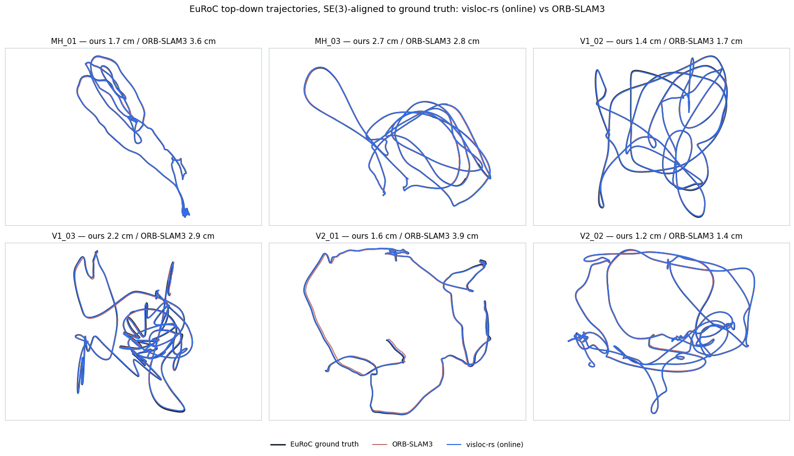
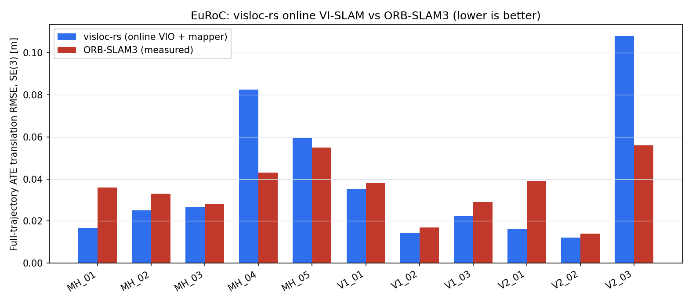

# Visual-Inertial SLAM (Basalt Rust port) — benchmark details

This page preserves the detailed VI-SLAM measurements relocated from the
[README](../README.md) front page. The estimator is a separate, faithful Rust
port of upstream [Basalt](https://github.com/VladyslavUsenko/basalt) commit
`0f3b2b52` — a tightly-coupled stereo-inertial VIO estimator plus an offline
structure-from-motion mapper — living in [`pipelines/basalt`](../pipelines/basalt)
and exercised end to end by
[`examples/basalt_euroc_vio_demo.rs`](../examples/basalt_euroc_vio_demo.rs).
It is not the vision-only stereo SLAM stack used in the SfM sections: Basalt
fuses IMU preintegration directly into the sliding-window optimizer, and this
port targets upstream numerical and structural fidelity (matching Basalt's own
frontend, factors, and marginalization) on the standard EuRoC benchmark, not a
from-scratch design.

<p align="center">
  
</p>

<p align="center"><sub>Six of the eight EuRoC sequences where this
repository's online VI-SLAM (blue) beats measured ORB-SLAM3
(red), both SE(3)-Umeyama-aligned to EuRoC ground truth (black). Full
results and protocol below.</sub></p>

## Beating ORB-SLAM3 on EuRoC

Same evaluator, one run per sequence, full-trajectory ATE with SE(3) Umeyama
alignment; ORB-SLAM3 measured on this machine (not a paper number). Both
systems use EuRoC's official per-sequence calibration — ORB-SLAM3 always did;
this repository switches its Basalt VIO's input calibration to match (see
"How this works" below). Estimator code is otherwise unchanged from the
faithful-port parity result linked at the end of this section. The mapper
runs **online**: a dedicated thread ingests each keyframe as the VIO
produces it (incremental detect/match/loop-check, a rate-limited
background-thread bundle adjustment, one final full pass at the end) instead
of a separate offline batch job over the whole sequence; see
[the online mapper design](basalt_online_mapper_design.md) and
[the global-consistency plan §1.5](vi_slam_global_consistency_plan.md#15-result-2026-09-16-the-offline-mappers-811-result-reproduced-online)
for the architecture and the full before/after evidence. The original
offline batch mapper (2-18 min / 3-6 GB peak RSS per sequence) still exists,
unchanged, for parity/comparison — see "How this works" and "Run it" below.

| Sequence | visloc-rs (online VI-SLAM) | ORB-SLAM3 stereo-inertial | Winner |
| --- | ---: | ---: | :---: |
| MH_01_easy | 0.0167 | 0.0363 | visloc-rs |
| MH_02_easy | 0.0250 | 0.0334 | visloc-rs |
| MH_03_medium | 0.0268 | 0.0283 | visloc-rs |
| MH_04_difficult | 0.0824 | 0.0428 | ORB-SLAM3 |
| MH_05_difficult | 0.0594 | 0.0546 | ORB-SLAM3 |
| V1_01_easy | 0.0353 | 0.0380 | visloc-rs |
| V1_02_medium | 0.0144 | 0.0170 | visloc-rs |
| V1_03_difficult | 0.0224 | 0.0287 | visloc-rs |
| V2_01_easy | 0.0164 | 0.0390 | visloc-rs |
| V2_02_medium | 0.0122 | 0.0140 | visloc-rs |
| V2_03_difficult | 0.1078 | 0.0563 | ORB-SLAM3 |

<p align="center"><sub>8/11 wins — the same 8 sequences the offline-mapper
result won. All values are full-trajectory ATE translation RMSE in metres,
lower is better, driver
<code>scripts/run_basalt_online_all11.py</code>, artifacts
<code>E:\visloc-rs-runs\basalt_online_20260915\{summary.md,summary.json,status/,runs/}</code>.
VIO alone, before the mapper's corrections, already beats ORB-SLAM3 on
MH_01_easy (0.030 vs 0.036 m) and V2_01_easy (0.027 vs 0.039 m).</sub></p>

<p align="center">
  
</p>

### Online-specific numbers: speed, and honest gaps vs the offline number

The offline-mapper table above is what "online" is measured against
per-sequence; here is that comparison plus the operational numbers (real-time
factor, mapper queue lag, loop/trigger counts, peak RSS) the offline table
never had because the offline mapper is not a live process:

| Sequence | Online SE3 | Offline SE3 | vs offline | RTF | Max queue lag | Loop pairs | Optimizer triggers | Peak RSS |
| --- | ---: | ---: | ---: | ---: | ---: | ---: | ---: | ---: |
| MH_01_easy | 0.0167 | 0.0154 | +8.6% | 0.133 | 2.64s | 487 | 4 | 528 MB |
| MH_02_easy | 0.0250 | 0.0244 | +2.5% | 0.124 | 2.45s | 349 | 3 | 384 MB |
| MH_03_medium | 0.0268 | 0.0264 | +1.3% | 0.139 | 3.80s | 394 | 3 | 331 MB |
| MH_04_difficult | 0.0824 | 0.0849 | -3.0% | 0.143 | 1.85s | 235 | 2 | 228 MB |
| MH_05_difficult | 0.0594 | 0.0611 | -2.8% | 0.088 | 4.18s | 195 | 3 | 297 MB |
| V1_01_easy | 0.0353 | 0.0352 | +0.3% | 0.160 | 3.43s | 263 | 3 | 357 MB |
| V1_02_medium | 0.0144 | 0.0139 | +3.9% | 0.190 | 4.49s | 136 | 2 | 173 MB |
| V1_03_difficult | 0.0224 | 0.0177 | **+26.5%** | 0.298 | 1.47s | 90 | 3 | 225 MB |
| V2_01_easy | 0.0164 | 0.0162 | +1.1% | 0.215 | 2.10s | 93 | 3 | 272 MB |
| V2_02_medium | 0.0122 | 0.0103 | **+18.1%** | 0.240 | 1.36s | 115 | 3 | 227 MB |
| V2_03_difficult | 0.1078 | 0.0653 | **+65.2%** | 0.379 | 1.07s | 76 | 2 | 147 MB |

8/11 sequences are within ~10% of the offline mapper's own number; **V1_03,
V2_02, and V2_03 are not**, and this is reported rather than hidden.
V2_02_medium's offline reference is itself a manually-rerun value (its
driver's automated attempt was killed by a wall-time monitor, see the table
above); V1_03 and V2_03's gap is real and its likely cause (still to be
confirmed) is that the rate-limited background-optimizer trigger gets fewer
chances to run on sequences with fewer loop events — V2_03 had only 2
optimizer triggers over the whole sequence, the fewest of all 11, and V1_03
3. On every sequence the mapper thread kept up with the VIO thread: total
wall time stayed within ~10% of VIO-alone wall time (e.g. MH_01: 1520.5s
total vs 1384.9s VIO-alone), and peak mapper queue lag never exceeded 4.5s —
the VIO was never blocked waiting on the mapper. Real-time factor (dataset
duration / wall time, 0.09-0.38× above) is bounded by the VIO estimator,
which is still single-threaded on this branch; real-time VIO performance is
a separate initiative (PR #153), not a claim of this stage.

Getting an online mapper that keeps up with the VIO took three real bugs
found and fixed via live full-sequence reruns: a bounded channel that
blocked the VIO thread whenever the mapper fell behind (replaced with an
unbounded one — a queued keyframe packet is cheap once its raw pixels are
dropped, which happens in the same call that receives it); the mapper
re-processing a keyframe packet's *entire* marginalization window every
time instead of only the images newly introduced since the last packet
(consecutive packets overlap heavily); and a "trigger on any accepted loop"
policy that fired on nearly every packet through a loop-revisited corridor,
replaced with a rate-limited trigger that runs each periodic optimization on
a cloned snapshot in its own thread so ingestion is never blocked by it.
Full detail: [the online mapper design](basalt_online_mapper_design.md) and
[the global-consistency plan §1.5](vi_slam_global_consistency_plan.md).

**How this works.** Basalt's shipped calibration is its own from-scratch DS
recalibration of EuRoC's raw images, not EuRoC's official factory pinhole
calibration (`mav0/cam{0,1}/sensor.yaml`) that ORB-SLAM3 uses — and it
carries a ~1.4% metric-scale bias, isolated by a visual-side sensitivity
probe (not IMU noise, which was tested and ruled out) to the stereo
calibration itself (~+0.45% effective focal length, ~+0.15% baseline vs the
official calibration).
[`euroc_official_to_ds_calib.py`](../scripts/euroc_official_to_ds_calib.py)
converts EuRoC's official calibration directly into Basalt's DS model
(GT-free; see
[`configs/basalt/variants/official_euroc_ds/README.txt`](../configs/basalt/variants/official_euroc_ds/README.txt)
for the fit-region rationale), which removes most of the bias; the
unchanged faithful NFR mapper then closes loops and optimises globally on
top of the corrected VIO output — now running online (a dedicated thread
ingesting each keyframe as the VIO produces it) rather than as a separate
offline batch job, see the "Online-specific numbers" section above. Full
root-cause diagnostics (E1/E2 visual-vs-IMU decomposition, IMU-noise
negative controls) are in [the plan doc](vi_slam_global_consistency_plan.md).

Two things this result is **not**: (a) the mapper's own detection/matching/
triangulation/bundle-adjustment code is unchanged from the offline port —
online-izing it added incremental scheduling and threading around that
code, not a new algorithm, and the offline batch path (`pipelines/basalt/src/
mapper/{mod.rs,session.rs,features.rs,triangulation.rs}`) remains
byte-for-byte untouched; (b) real-time VIO — the estimator itself is still
single-threaded on this branch (real-time factor 0.09-0.38× above), so
"online" here means the mapper keeps pace with whatever rate the VIO runs
at, not wall-clock real time; VIO-side real-time performance is a separate
initiative (PR #153). The three losses (MH_04, MH_05, V2_03) are VIO
tracking-robustness limits on fast/motion-blurred/dark sequences, not
mapper or calibration limits — see
[`vi_slam_global_consistency_plan.md`](vi_slam_global_consistency_plan.md)
for next steps.

## Pipeline

```mermaid
flowchart LR
    IMG["Stereo cam0 / cam1 PNGs<br/>euroc.rs"] --> PYR["Basalt image pyramid<br/>pyramid.rs"]
    PYR --> FAST["FAST-9 grid detector<br/>fast.rs"]
    FAST --> OF["Frame-to-frame optical flow<br/>Pattern51 patches<br/>stream.rs / patch.rs / pattern.rs"]
    OF --> EPI["Stereo epipolar filter<br/>adapter.rs"]
    IMU["IMU samples"] --> PRE["IMU preintegration<br/>imu/preintegration.rs, imu/sampling.rs"]
    EPI --> INIT["Initialization<br/>initialization.rs"]
    PRE --> INIT
    INIT --> LM["ABS_QR LM sliding window + FEJ<br/>vio/estimator.rs, vio/window.rs, vio/aom.rs"]
    LM --> MARG["Square-root marginalization<br/>vio/margdata.rs"]
    MARG --> OUT["Trajectory (TUM / CSV) + MargData packets<br/>adapter.rs"]
    OUT --> MAP["Offline mapper<br/>mapper/mod.rs, mapper/session.rs"]
    MAP --> MATCH["Keyframe matching + 5-pt Stewenius RANSAC<br/>mapper/features.rs"]
    MATCH --> TRI["Triangulation + bundle adjustment<br/>mapper/triangulation.rs"]
    TRI --> PTS["map.json / points.json / poses.json"]
```



<p align="center"><sub>Node labels are the actual source modules under
<a href="../pipelines/basalt/src">pipelines/basalt/src</a>. Marginalization
(<code>sqrt_to_sqrt_marginalize</code> in <code>vio/margdata.rs</code>) runs
every frame; a MargData packet is only written to disk when Basalt selects a
keyframe for removal, which is what feeds the offline mapper.</sub></p>

## Run it

Build with AVX2/FMA and the LM-workspace-reuse optimization used for the
measurements above, then replay one EuRoC sequence through the **online**
VIO + mapper (`--calibration`/`--config` below are checked into this
repository; `--euroc-dir` is an external dataset path) — this reproduces
the headline table:

```bash
RUSTFLAGS="-C target-feature=+avx2,+fma" \
  cargo build --release --example basalt_euroc_online_slam_demo --features basalt-lm-workspace-reuse

cargo run --release --example basalt_euroc_online_slam_demo --features basalt-lm-workspace-reuse -- \
  --euroc-dir /path/to/MH_01_easy \
  --calibration configs/basalt/variants/official_euroc_ds/euroc_ds_calib.json \
  --config configs/basalt/variants/official_euroc_ds/euroc_config.json \
  --out-dir target/basalt_mh01_online \
  --optimize-every-k 100 --periodic-iterations 4
```

This writes `trajectory_online.tum` (full-frame, mapper corrections
propagated to every VIO frame — the file scored above),
`trajectory_online_kf.tum` (keyframes only), and
`timing_breakdown_online.json` (RTF, mapper queue lag, loop/trigger counts,
per-stage optimize timing, peak RSS). `--realtime` paces input at dataset
rate instead of as fast as possible; `--help` lists every flag. The example
never reads a ground-truth file — all outputs are produced causally from
sensor data and estimator state.
[`scripts/run_basalt_online_all11.py`](../scripts/run_basalt_online_all11.py)
drives this across all 11 EuRoC sequences (detached, resumable, live
`summary.md`/`summary.json`).

The original **offline** VIO + batch-mapper path
(`examples/basalt_euroc_vio_demo.rs` +
`examples/basalt_mapper_offline_demo.rs`) is unchanged and still available
for parity/comparison runs:

```bash
RUSTFLAGS="-C target-feature=+avx2,+fma" \
  cargo build --release --example basalt_euroc_vio_demo --features basalt-lm-workspace-reuse
```

Then replay one EuRoC sequence (`--calibration` and `--config` below are
checked into this repository; `--euroc-dir` is an external dataset path):

```bash
cargo run --release --example basalt_euroc_vio_demo --features basalt-lm-workspace-reuse -- \
  --euroc-dir /path/to/MH_01_easy \
  --calibration benchmarks/basalt/release_inputs/euroc_ds_calib.json \
  --config configs/basalt/euroc_config.json \
  --out-dir target/basalt_mh01 \
  --max-frames 80
```

This writes `trajectory.tum`, `trajectory.csv`, `trace.jsonl`, a
`marg_data/` directory of per-keyframe MargData JSON packets (the offline
mapper's input), and `summary.txt` under `--out-dir`. Pass `--no-trace`
and/or `--no-marg-data` to drop the diagnostic trace and MargData output
respectively; `--help` lists every flag. The example never reads a ground-truth
file — all outputs are produced causally from sensor data and estimator state.

To reproduce the same result via the offline batch mapper instead (the
result this branch's online path was checked against, not the headline
table above), swap in the official-calibration variant (keep
`--no-marg-data` off, since the mapper needs it) and then run the offline
mapper on the resulting `marg_data/` directory:

```bash
cargo run --release --example basalt_euroc_vio_demo --features basalt-lm-workspace-reuse -- \
  --euroc-dir /path/to/MH_01_easy \
  --calibration configs/basalt/variants/official_euroc_ds/euroc_ds_calib.json \
  --config configs/basalt/variants/official_euroc_ds/euroc_config.json \
  --out-dir target/basalt_mh01_official

cargo run --release --example basalt_mapper_offline_demo -- \
  --marg-dir target/basalt_mh01_official/marg_data \
  --calibration configs/basalt/variants/official_euroc_ds/euroc_ds_calib.json \
  --config configs/basalt/variants/official_euroc_ds/euroc_config.json \
  --out-dir target/basalt_mh01_official_mapper
```

`configs/basalt/variants/official_euroc_ds/euroc_ds_calib.json` is produced
from EuRoC's own factory pinhole-radtan calibration by
[`euroc_official_to_ds_calib.py`](../scripts/euroc_official_to_ds_calib.py)
(GT-free; see its
[README](../configs/basalt/variants/official_euroc_ds/README.txt) for the fit
decision). The mapper writes `trajectory.tum`/`trajectory.csv` (keyframe
poses) plus `poses.json`/`points.json`/`map.json`/`mapper_report.json`; to
propagate the mapper's corrections onto the full (non-keyframe) VIO
trajectory for scoring, run
[`propagate_basalt_mapper_corrections.py`](../scripts/propagate_basalt_mapper_corrections.py):

```bash
python3 scripts/propagate_basalt_mapper_corrections.py \
  --vio-trajectory-csv target/basalt_mh01_official/trajectory.csv \
  --mapper-poses-json target/basalt_mh01_official_mapper/poses.json \
  --out-tum target/basalt_mh01_official_mapper/full_trajectory.tum
```

`scripts/run_basalt_official_calib_all11.py` drives all three steps above
plus evaluation across all 11 EuRoC sequences (detached, resumable, writes a
live-updating `summary.md`/`summary.json`); see its module docstring.

## Honest caveats

- The mapper (offline or online) matches native's match graph exactly but
  its final point coordinates are only verified within 1 mm of native, not
  bit-exact.
- "Online" means the mapper thread keeps pace with the VIO thread (never
  blocking it, whole-run wall time within ~10% of VIO-alone wall time), not
  wall-clock real time: the VIO estimator itself is still single-threaded on
  this branch (real-time factor 0.09-0.38× on the sequences above);
  real-time VIO performance is a separate initiative (PR #153).
- V1_03_difficult and V2_03_difficult's online ATE is a real, reported gap
  from the offline mapper's own number (+26.5% and +65.2% respectively, both
  above the ~10% target) — likely because the rate-limited background
  optimizer trigger gets fewer chances to run on sequences with fewer loop
  events (V2_03 had only 2 triggers over the whole sequence). Not yet fixed;
  see [the plan doc §1.5](vi_slam_global_consistency_plan.md) for the
  candidate cause and the branch history for the debugging record.
- MH_04, MH_05, and V2_03 remain losses vs ORB-SLAM3 (online and offline
  alike): these are VIO tracking-robustness limits on fast/motion-blurred/
  dark sequences, not calibration or mapper limits — see
  [the plan doc](vi_slam_global_consistency_plan.md) for next steps.
- V2_02_medium's *offline* reference number (used only for the "vs offline"
  comparison, not the headline ORB-SLAM3 table) is from a manual rerun
  after the offline all-11 sweep's own attempt for that sequence hit a
  driver wall-time-monitor artefact.
- The offline batch mapper (2-18 minutes, 3-6 GB peak RSS per sequence) is
  unchanged and still available; peak RSS for the online path is reported
  per-sequence above (147-528 MB) but was not a tuning target for this
  stage — accuracy and keeping pace with the VIO were.
- The Cargo license inventory resolves 119/119 package licenses, but legal
  clearance was not sought or claimed — this is an engineering audit, not a
  legal one.

Separately, on upstream Basalt's own shipped calibration/config inputs (not
the official-calibration result above), the Rust port matches native
Basalt's ATE to within **0.1%** on all 11 EuRoC sequences and is byte-exact
cross-target (Windows ↔ Linux) at the trajectory/lifecycle level, with
**1.13×** runtime and **0.56×** peak RSS vs native on the same-domain Linux
measurement — this is the separate faithful-port parity claim; see the
[faithful-port closure report](../work/m11_basalt_faithful_port_final_closure_20260914.md)
and [upstream oracle / provenance](../benchmarks/basalt/README.md) for the full
parity evidence.
