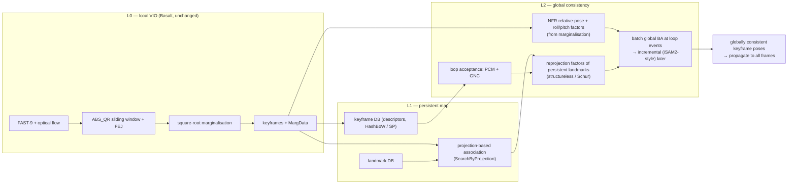

# VI-SLAM global-consistency plan: Basalt-class local VIO + ORB-SLAM3-class global consistency

Status: plan, 2026-09-15. Owner goal: beat existing OSS visual-inertial SLAM on EuRoC —
ORB-SLAM3 stereo-inertial first, VINS-Mono second — while keeping the Basalt Rust
port's runtime/memory edge.

This document records (1) the same-protocol evidence gathered on 2026-09-14/15,
(2) the diagnosis of where the accuracy gap actually is, (3) the architecture we
will build, and (4) a staged plan with kill criteria. Everything numeric here comes
from artifacts named inline; nothing is tuned against ground truth unless stated.

## 1. Evidence so far

### 1.1 Same-protocol ORB-SLAM3 stereo-inertial vs the Basalt Rust port

ORB-SLAM3 (upstream `4452a3c`, stock `EuRoC.yaml` + `ORBvoc.txt`, viewer off, one
run per sequence, WSL Ubuntu 22.04 on the same machine) evaluated with
`scripts/evaluate_euroc_trajectory.py` (SE(3) Umeyama, 10 ms association, full
trajectory) — the same evaluator used for the Basalt gate report. Artifacts:
`E:\visloc-rs-runs\orbslam3_euroc_20260914\summary.{json,md}`; the single source
patch (CRLF strip in the EuRoC timestamp loader) is stored next to them.

| Sequence | Basalt Rust VIO | ORB-SLAM3 SI measured | ORB-SLAM3 SI paper | Ratio |
| --- | ---: | ---: | ---: | ---: |
| MH_01 | 0.066 | 0.036 | 0.036 | 1.8 |
| MH_02 | 0.058 | 0.033 | 0.033 | 1.8 |
| MH_03 | 0.062 | 0.028 | 0.035 | 2.2 |
| MH_04 | 0.114 | 0.043 | 0.051 | 2.7 |
| MH_05 | 0.145 | 0.055 | 0.082 | 2.6 |
| V1_01 | 0.043 | 0.038 | 0.038 | 1.1 |
| V1_02 | 0.045 | 0.017 | 0.014 | 2.6 |
| V1_03 | 0.053 | 0.029 | 0.024 | 1.8 |
| V2_01 | 0.039 | 0.039 | 0.032 | 1.0 |
| V2_02 | 0.049 | 0.014 | 0.014 | 3.5 |
| V2_03 | 0.230 | 0.056 | 0.024 | 4.1 |

ATE translation RMSE in metres. Accuracy: 0/11 wins. Efficiency (MH_01, same WSL
domain): ORB-SLAM3 486 s wall / ~0.9–1.07 GB peak RSS (multi-threaded) vs Rust
Basalt 731 s / 29 MB (single-threaded). The Basalt VIO numbers match native Basalt
to <0.1 % and are consistent with Basalt's own published VIO results, so the gap is
Basalt's design ceiling, not a porting defect.

### 1.2 Post-process loop-closure experiments (branch `exp/basalt-loop-closure-ceiling`)

Custom post-process on top of the VIO output, results in
`E:\visloc-rs-runs\basalt_lc_ceiling_20260914\summary*.json`.

Stage A — SE(3) pose graph. Loop candidates from VIO pose proximity (temporal gap
> 20 s, radius 1 m + 3 % of path, view angle ≤ 45°, appearance top-3), verified by
SuperPoint + LightGlue → stereo triangulation → PnP RANSAC both ways, gated by
consistency with the VIO relative pose. Loop-edge weight was swept against GT on
MH_01 only (`loop_weight_scale=2e-5`, `loop_weight_max=1e-3`) and then frozen for
all sequences.

| Sequence | VIO | +pose graph | ORB-SLAM3 | loops | GT-false | mean loop rel. err | wall |
| --- | ---: | ---: | ---: | ---: | ---: | ---: | ---: |
| MH_01 | 0.066 | 0.055 | 0.036 | 35 | 0 | 0.045 m | 9.4 min |
| MH_02 | 0.058 | 0.062 | 0.033 | 30 | 0 | 0.045 m | 7.2 min |
| MH_03 | 0.062 | 0.050 | 0.028 | 28 | 1 | 0.065 m | 7.8 min |
| MH_04 | 0.114 | 0.099 | 0.043 | 15 | 0 | 0.102 m | 5.4 min |
| MH_05 | 0.145 | 0.092 | 0.055 | 14 | 2 | 0.113 m | 5.4 min |
| V1_01 | 0.043 | 0.045 | 0.038 | 29 | 0 | 0.084 m | 7.5 min |
| V1_02 | 0.045 | 0.039 | 0.017 | 16 | 1 | 0.076 m | 4.6 min |
| V1_03 | 0.053 | 0.041 | 0.029 | 16 | 0 | 0.068 m | 9.4 min |
| V2_01 | 0.039 | 0.041 | 0.039 | 4 | 1 | 0.115 m | 9.3 min |
| V2_02 | 0.049 | 0.048 | 0.014 | 22 | 4 | 0.090 m | 7.5 min |
| V2_03 | 0.230 | 0.185 | 0.056 | 11 | 0 | 0.059 m | 4.8 min |

8/11 improve, mean −12 %, 0/11 wins. The accepted loops' relative-pose error
(4.5–11.5 cm, GT-checked post hoc) is larger than the target ATE, so a pose graph
built from single-pair PnP loops cannot reach 3–4 cm.

Stage B — global BA on the Stage-A result (MH_01 only). v1 (per-keyframe stereo
landmarks, no track fusion): 0.057. v2 (union-find track fusion over stereo +
temporal k..k+2 + covisibility top-4 + loop matches; 8,638 tracks, mean length
8 keyframes; Huber, odometry priors, converged): **0.0595 — no better than the pose
graph** despite a 33 % reprojection-error reduction.

A pre-existing negative control with mean-pooled SIFT retrieval (no VIO-proximity
gate) made things much worse (MH_01 0.184, MH_02 0.331) because self-consistent
but wrong PnP loops on repetitive texture passed verification.

### 1.3 Native Basalt offline mapper (in progress)

The ported NFR mapper (`pipelines/basalt/src/mapper`, `examples/basalt_mapper_offline_demo.rs`;
HashBoW loop candidates + 5-pt RANSAC + non-linear factor recovery + global
optimisation) is being run on all 11 sequences from the fresh MargData under
`E:\visloc-rs-runs\basalt_lc_ceiling_20260914\vio_marg\<SEQ>\`. Results will land in
`E:\visloc-rs-runs\basalt_mapper_all11_20260915\summary.{json,md}` (branch
`exp/basalt-mapper-all11`; driver `scripts/run_basalt_mapper_all11.py`, mapper
invoked as `basalt_mapper_offline_demo --marg-dir <SEQ>/marg_data --calibration
benchmarks/basalt/release_inputs/euroc_ds_calib.json --config
configs/basalt/euroc_config.json`).

MH_01 (complete): 454 packets → 461 keyframes, 12,935 accepted pairs from HashBoW
temporal + loop queries, two optimisation rounds converged.
**Keyframe ATE SE(3) 0.0658 m, full-trajectory ATE SE(3) 0.0647 m vs VIO 0.066 m —
about 2 % gain**, i.e. no better than the raw VIO and behind both the custom pose
graph (0.055 m) and ORB-SLAM3 (0.036 m). Sim(3) ATE is 0.012 m, so what remains
is mostly a mild scale/gauge drift rather than local error. Cost: 18 min wall,
6.3 GB peak RSS for one sequence. The remaining 10 sequences are running; on this
evidence the native mapper's BoW + relative-pose stage is not the missing piece,
which points Stage 1 at the L1/L2 design below rather than at the mapper as-is.

## 2. Diagnosis

| Symptom | Evidence | What is missing |
| --- | --- | --- |
| Machine-hall sequences lose 1.8–2.7× | Pose graph recovers only 12 %; loop relative error 4.5–11 cm | Loop closure as *landmark reprojection factors* in the global problem, not one relative-pose edge per loop (OKVIS2) |
| Room sequences (V1_02, V2_02, 3 m × 3 m) lose 2.6–3.5× with no drift to remove | ORB-SLAM3 0.014–0.017 vs Basalt 0.045–0.049 | A persistent map with continuous re-observation of the same landmarks (ORB-SLAM3 local mapping) — Basalt marginalises landmarks out of the window and never sees them again |
| Global BA does not bite | Tracks average 8 keyframes; no IMU-derived factors in the BA | Sequence-long tracks via projection-based association, plus marginalisation-derived relative factors (Basalt NFR ≡ OKVIS2 pose-graph edges) to keep VIO-grade local precision and gravity |
| False loops survive geometric verification | SIFT control run; 9 GT-false loops in Stage A | Pairwise-consistency outlier rejection (Kimera-RPGO PCM) + GNC instead of ad-hoc gates |

Conclusion: Basalt is a VIO plus an *offline* mapper, not an online SLAM. Keeping it
as the local layer is right (speed, 29 MB RSS, robustness — it completes V2_03
where its paper did not). Beating ORB-SLAM3 requires adding the two things
ORB-SLAM3 has and Basalt lacks: persistent-map re-observation and a consistent
global back-end with robust loop handling.

## 3. Architecture: three layers (OKVIS2-style)

- **L0** is the Basalt port as merged in PR #145. No changes; its MargData is the
  interface.
- **L1** borrows ORB-SLAM3's local-mapping idea: keep every keyframe's descriptors
  and every landmark; for each new keyframe project the map into it using the
  current estimate and match by descriptor within a search window. This yields
  sequence-long tracks at O(landmarks) cost instead of O(keyframe pairs) LightGlue
  calls. The repository already has projection-guided tracking
  (`pipelines/tracking`) to reuse.
- **L2** borrows from three sources:
  - OKVIS2: marginalisation-derived relative-pose factors summarise old windows
    (our NFR port already recovers exactly these), loop-closure landmarks enter as
    reprojection factors, and the global optimisation runs in a background thread.
  - Kimera-RPGO: Pairwise Consistency Maximisation over loop candidates using the
    odometry covariance, followed by GNC on the residuals. This replaces the
    hand-tuned VIO-consistency gate and needs no GT.
  - GTSAM: factor-graph abstraction, structureless (smart) projection factors
    eliminated by Schur complement, iSAM2-style incremental relinearisation once the
    batch version works. We borrow the design, not the library.

## 4. Staged plan with kill criteria

Rules for every stage: parameters fixed a priori and identical across the 11
sequences; GT used only for evaluation; ORB-SLAM3 numbers are the same-protocol
measurements in §1.1; every claim cites an artifact path.

| Stage | Work | Pass | Kill / pivot |
| --- | --- | --- | --- |
| 0 (running; MH_01 done: +2 %) | Native Basalt mapper on all 11 (L0 + NFR + BoW loops, no L1) | Beats ORB-SLAM3 on any sequence → build L1/L2 on the mapper's factor graph | Fails to improve on VIO (MH_01 already does) → its BoW/RANSAC stage is the weak link; L1/L2 start from the Stage-A/B code and reuse only the NFR factor recovery |
| 1 | Offline L1 + L2 on **V1_02** first, then MH_01: projection-based association → sequence-long tracks; NFR factors + reprojection factors; PCM + GNC loop acceptance; batch global BA | V1_02 ≤ 0.025 m, MH_01 ≤ 0.040 m | V1_02 does not improve → local VIO is the limit → Stage 1b |
| 1b | Basalt front-end strengthening only if 1 fails: more features per frame, longer patch lifetime, SuperPoint descriptors for association | V1_02 improves | No improvement → the Basalt-as-L0 premise is wrong; reconsider OKVIS2-style VIO |
| 2 | All 11 offline, resumable, per-sequence wall/RSS recorded | ≥ 6/11 wins vs ORB-SLAM3 measured; no sequence worse than VIO | < 4/11 → stop and write the honest negative |
| 3 | Online: L1/L2 in a background thread behind the live VIO, incremental solve, memory budget ≤ 200 MB peak | Real-time on EuRoC, accuracy within 10 % of Stage 2 | Budget blown → keep offline mode as the shipped claim |
| 4 | Same-protocol re-measurement (ORB-SLAM3 one run, ours one run), README VI-SLAM section update with figures/tables | — | — |

V1_02 is the first target on purpose: the room sequences have no drift to remove,
so they isolate whether persistent-map re-observation (L1) is worth anything before
any global-consistency work is done.

## 5. Reading list for implementers

- OKVIS2 — Leutenegger, *OKVIS2: Realtime Scalable Visual-Inertial SLAM with Loop
  Closure*, arXiv:2202.09199. Read: pose-graph edges from marginalisation; loop
  closure keyframes' landmarks re-entering as reprojection factors; the
  background-thread global optimisation and its hand-over to the live estimator.
- Kimera-RPGO — Rosinol et al., *Kimera*, ICRA 2020, §robust PGO; PCM: Mangelson et
  al., ICRA 2018; GNC: Yang et al., RA-L 2020.
- GTSAM — smart factors: Carlone et al., ICRA 2014; iSAM2: Kaess et al., IJRR 2012.
- ORB-SLAM3 — Campos et al., T-RO 2021: covisibility graph, `SearchByProjection`,
  loop welding + full VI BA.
- Basalt NFR — Usenko et al., RA-L 2020: what the ported mapper already computes.

## 6. Risks

- The largest risk is that Basalt's local VIO is itself the limit on room
  sequences; Stage 1 on V1_02 is designed to expose that first.
- Effort through Stage 2 is weeks, not days; Stage 3 (online) is a separate
  build.
- The offline mapper's memory (6 GB at 454 keyframes) shows that a naive dense
  factor graph will not keep the 29 MB story; L2 must be structureless/Schur from
  the start and bounded in keyframes.

## 7. Artifacts and branches

- ORB-SLAM3 measurements: `E:\visloc-rs-runs\orbslam3_euroc_20260914\`
- Post-process experiments: branch `exp/basalt-loop-closure-ceiling`
  (`examples/basalt_loop_closure_postprocess.rs`,
  `scripts/run_basalt_loop_closure_ceiling.py`), results and feature caches in
  `E:\visloc-rs-runs\basalt_lc_ceiling_20260914\`
- Native mapper all-11: branch `exp/basalt-mapper-all11`, results in
  `E:\visloc-rs-runs\basalt_mapper_all11_20260915\`
- README VI-SLAM section: PR #147; Basalt port: PR #145.
