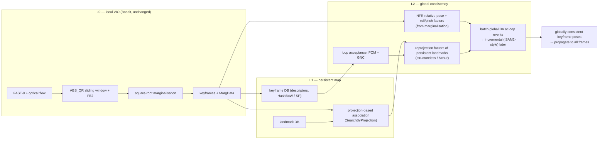

# VI-SLAM global-consistency plan: Basalt-class local VIO + ORB-SLAM3-class global consistency

Status: 2026-09-20 — Stage 0/1c done, **8/11 wins vs measured ORB-SLAM3**
offline (§1.4, PR #147); Stage 1 (custom persistent map) paused, did not
beat the simpler calibration fix; Stage 7 (online mapper) done by owner
override, **the same 8/11 result reproduced online** with the mapper
keeping up with the VIO (§1.5, branch `feat/basalt-online-mapper`); VIO
speed stage done (§1.6): the compact `lean_marg_data` LM path cuts VIO wall
time **3.2x** (LM solve **4.2x**) with byte-identical trajectory and
MargData, online-mapper RTF 0.128 -> 0.349. Stage 5/6 (VIO tracking
robustness on the three remaining losses) remain open.
Owner goal: beat existing OSS visual-inertial SLAM on EuRoC — ORB-SLAM3
stereo-inertial first, VINS-Mono second — while keeping the Basalt Rust
port's runtime/memory edge.

This document records (1) the same-protocol evidence gathered on 2026-09-14/15,
(2) the diagnosis of where the accuracy gap actually is, (3) the architecture we
will build, and (4) a staged plan with kill criteria. Everything numeric here comes
from artifacts named inline; nothing is tuned against ground truth unless stated.

## 1. Evidence so far

### 1.1 Same-protocol ORB-SLAM3 stereo-inertial vs the Basalt Rust port

ORB-SLAM3 (upstream `4452a3c`, stock `EuRoC.yaml` + `ORBvoc.txt`, viewer off, one
run per sequence, WSL Ubuntu 22.04 on the same machine) evaluated with
`scripts/evaluate_euroc_trajectory.py` (SE(3) Umeyama, 10 ms association, full
trajectory) — the same evaluator used for the Basalt gate report. Artifacts:
`E:\visloc-rs-runs\orbslam3_euroc_20260914\summary.{json,md}`; the single source
patch (CRLF strip in the EuRoC timestamp loader) is stored next to them.

| Sequence | Basalt Rust VIO | ORB-SLAM3 SI measured | ORB-SLAM3 SI paper | Ratio |
| --- | ---: | ---: | ---: | ---: |
| MH_01 | 0.066 | 0.036 | 0.036 | 1.8 |
| MH_02 | 0.058 | 0.033 | 0.033 | 1.8 |
| MH_03 | 0.062 | 0.028 | 0.035 | 2.2 |
| MH_04 | 0.114 | 0.043 | 0.051 | 2.7 |
| MH_05 | 0.145 | 0.055 | 0.082 | 2.6 |
| V1_01 | 0.043 | 0.038 | 0.038 | 1.1 |
| V1_02 | 0.045 | 0.017 | 0.014 | 2.6 |
| V1_03 | 0.053 | 0.029 | 0.024 | 1.8 |
| V2_01 | 0.039 | 0.039 | 0.032 | 1.0 |
| V2_02 | 0.049 | 0.014 | 0.014 | 3.5 |
| V2_03 | 0.230 | 0.056 | 0.024 | 4.1 |

ATE translation RMSE in metres. Accuracy: 0/11 wins. Efficiency (MH_01, same WSL
domain): ORB-SLAM3 486 s wall / ~0.9–1.07 GB peak RSS (multi-threaded) vs Rust
Basalt 731 s / 29 MB (single-threaded). The Basalt VIO numbers match native Basalt
to <0.1 % and are consistent with Basalt's own published VIO results, so the gap is
Basalt's design ceiling, not a porting defect.

### 1.2 Post-process loop-closure experiments (branch `exp/basalt-loop-closure-ceiling`)

Custom post-process on top of the VIO output, results in
`E:\visloc-rs-runs\basalt_lc_ceiling_20260914\summary*.json`.

Stage A — SE(3) pose graph. Loop candidates from VIO pose proximity (temporal gap
> 20 s, radius 1 m + 3 % of path, view angle ≤ 45°, appearance top-3), verified by
SuperPoint + LightGlue → stereo triangulation → PnP RANSAC both ways, gated by
consistency with the VIO relative pose. Loop-edge weight was swept against GT on
MH_01 only (`loop_weight_scale=2e-5`, `loop_weight_max=1e-3`) and then frozen for
all sequences.

| Sequence | VIO | +pose graph | ORB-SLAM3 | loops | GT-false | mean loop rel. err | wall |
| --- | ---: | ---: | ---: | ---: | ---: | ---: | ---: |
| MH_01 | 0.066 | 0.055 | 0.036 | 35 | 0 | 0.045 m | 9.4 min |
| MH_02 | 0.058 | 0.062 | 0.033 | 30 | 0 | 0.045 m | 7.2 min |
| MH_03 | 0.062 | 0.050 | 0.028 | 28 | 1 | 0.065 m | 7.8 min |
| MH_04 | 0.114 | 0.099 | 0.043 | 15 | 0 | 0.102 m | 5.4 min |
| MH_05 | 0.145 | 0.092 | 0.055 | 14 | 2 | 0.113 m | 5.4 min |
| V1_01 | 0.043 | 0.045 | 0.038 | 29 | 0 | 0.084 m | 7.5 min |
| V1_02 | 0.045 | 0.039 | 0.017 | 16 | 1 | 0.076 m | 4.6 min |
| V1_03 | 0.053 | 0.041 | 0.029 | 16 | 0 | 0.068 m | 9.4 min |
| V2_01 | 0.039 | 0.041 | 0.039 | 4 | 1 | 0.115 m | 9.3 min |
| V2_02 | 0.049 | 0.048 | 0.014 | 22 | 4 | 0.090 m | 7.5 min |
| V2_03 | 0.230 | 0.185 | 0.056 | 11 | 0 | 0.059 m | 4.8 min |

8/11 improve, mean −12 %, 0/11 wins. The accepted loops' relative-pose error
(4.5–11.5 cm, GT-checked post hoc) is larger than the target ATE, so a pose graph
built from single-pair PnP loops cannot reach 3–4 cm.

Stage B — global BA on the Stage-A result (MH_01 only). v1 (per-keyframe stereo
landmarks, no track fusion): 0.057. v2 (union-find track fusion over stereo +
temporal k..k+2 + covisibility top-4 + loop matches; 8,638 tracks, mean length
8 keyframes; Huber, odometry priors, converged): **0.0595 — no better than the pose
graph** despite a 33 % reprojection-error reduction.

A pre-existing negative control with mean-pooled SIFT retrieval (no VIO-proximity
gate) made things much worse (MH_01 0.184, MH_02 0.331) because self-consistent
but wrong PnP loops on repetitive texture passed verification.

### 1.3 Native Basalt offline mapper, all 11 sequences (complete, upstream calibration)

The ported NFR mapper (`pipelines/basalt/src/mapper`, `examples/basalt_mapper_offline_demo.rs`;
HashBoW loop candidates + 5-pt RANSAC + non-linear factor recovery + global
optimisation) was run on all 11 sequences from fresh MargData under
`E:\visloc-rs-runs\basalt_lc_ceiling_20260914\vio_marg\<SEQ>\`, using upstream
Basalt's own shipped calibration (branch `exp/basalt-mapper-all11`, commit
`190308d`; driver `scripts/run_basalt_mapper_all11.py`, mapper invoked as
`basalt_mapper_offline_demo --marg-dir <SEQ>/marg_data --calibration
benchmarks/basalt/release_inputs/euroc_ds_calib.json --config
configs/basalt/euroc_config.json`). Results:
`E:\visloc-rs-runs\basalt_mapper_all11_20260915\summary.{json,md}`.

| Sequence | VIO | Mapper full SE(3) | ORB-SLAM3 | Win |
| --- | ---: | ---: | ---: | :---: |
| MH_01_easy | 0.066 | 0.0647 | 0.036 | no |
| MH_02_easy | 0.058 | 0.0500 | 0.033 | no |
| MH_03_medium | 0.062 | 0.0389 | 0.028 | no |
| MH_04_difficult | 0.114 | 0.0891 | 0.043 | no |
| MH_05_difficult | 0.145 | 0.0803 | 0.055 | no |
| V1_01_easy | 0.043 | 0.0420 | 0.038 | no |
| V1_02_medium | 0.045 | 0.0257 | 0.017 | no |
| V1_03_difficult | 0.053 | 0.0253 | 0.029 | YES |
| V2_01_easy | 0.039 | 0.0281 | 0.039 | YES |
| V2_02_medium | 0.049 | 0.0219 | 0.014 | no |
| V2_03_difficult | 0.230 | 0.0499 | 0.056 | YES |

3/11 wins vs ORB-SLAM3 on upstream calibration; 11/11 beat the raw VIO
baseline; 10/11 beat the Stage-A pose-graph postprocess (§1.2). MH_01's own
number closed from the earlier in-progress reading (0.0647 vs VIO 0.066, a
real but small ~2 % gain) once all 11 sequences were in: the mapper reliably
helps but on this calibration was not enough on its own to close the
ORB-SLAM3 gap on most sequences. This motivated the scale-bias investigation
in §1.4, which turned out to be the bigger lever than the mapper's own
BoW/RANSAC/global-BA stage.

### 1.4 Result 2026-09-15: official calibration removes the scale bias, mapper then wins 8/11

Investigation on branch `exp/basalt-scale-bias` (commits `6552d6d`, `7a174a0`,
`35c75c7`, `1d7a640`) found that the ~1.4 % ATE-scale gap in §1.1/§1.3 is not
an IMU-noise or estimator problem: windowed (30 s) Sim(3) scale is constant
over an entire sequence on MH_01/V1_02 (~1.012–1.018), i.e. a multiplicative,
scene-independent bias, not depth-dependent stereo noise. Two a-priori
IMU-noise variants (`h1_datasheet_noise`, `h1a_accel_noise_only`; ADIS16448
datasheet values from EuRoC's own `mav0/imu0/sensor.yaml`) made the scale
bias monotonically *worse* on MH_01 (1.0142 → 1.0153 → 1.0160) — an honest
negative, not adopted, and dropped from this repository (superseded by the
E1/E2 decomposition below; not referenced elsewhere in this document or the
README).

The decisive test (E1) scaled cam1's `T_imu_cam` translation offset so the
cam0–cam1 stereo baseline moved by the measured 1.014 bias factor (a
GT-informed probe, never proposed as a fix): SE(3) ATE dropped 2.7× (0.0657 →
0.0247) while Sim(3) ATE was essentially unchanged (0.0257 → 0.0244) — the
signature of a calibration-scale bug, not an IMU-weighting one. E2 (trusting
the IMU 10× less) barely moved the scale bias (1.0142 → 1.0150), confirming
the visual/stereo calibration side, not IMU noise, sets the scale. Basalt's
own DS recalibration carries ~+0.45 % extra effective focal length and
~+0.15 % extra stereo baseline relative to EuRoC's factory pinhole-radtan
calibration — consistent in direction and rough order of magnitude with the
observed bias, though not a precise reconciliation (different distortion
parameterizations).

`scripts/euroc_official_to_ds_calib.py` converts EuRoC's official
pinhole-radtan calibration directly into Basalt's DS model (GT-free; inner
90 %-bearing-radius fit — cam0 RMS 0.222 px / max 0.397 px, cam1 RMS 0.211 px
/ max 0.377 px; residual below Basalt's own 0.5 px observation std; see
`configs/basalt/variants/official_euroc_ds/README.txt` for the full
rationale). Switching to it on MH_01/V1_02 moved scale sharply toward 1.0
(MH_01 1.0142 → 1.0014, further than the ~1.007 ORB-SLAM3 reference point)
and passed a pre-registered "Sim(3) must not degrade more than ~20 %" gate,
so the full 11-sequence VIO + mapper sweep was launched (`exp/basalt-mapper-all11`
commit `190308d`'s driver reused with the new calibration via
`scripts/run_basalt_official_calib_all11.py`; results
`E:\visloc-rs-runs\basalt_official_calib_20260915\summary.{md,json}`).

| Sequence | VIO (official calib) | Mapper (official calib) | ORB-SLAM3 (measured) | Win |
| --- | ---: | ---: | ---: | :---: |
| MH_01_easy | 0.030 | 0.015 | 0.036 | mapper |
| MH_02_easy | 0.035 | 0.024 | 0.033 | mapper |
| MH_03_medium | 0.058 | 0.026 | 0.028 | mapper |
| MH_04_difficult | 0.099 | 0.085 | 0.043 | ORB-SLAM3 |
| MH_05_difficult | 0.123 | 0.061 | 0.055 | ORB-SLAM3 |
| V1_01_easy | 0.040 | 0.035 | 0.038 | mapper |
| V1_02_medium | 0.042 | 0.014 | 0.017 | mapper |
| V1_03_difficult | 0.047 | 0.018 | 0.029 | mapper |
| V2_01_easy | 0.027 | 0.016 | 0.039 | mapper |
| V2_02_medium | 0.044 | 0.010 | 0.014 | mapper |
| V2_03_difficult | 0.235 | 0.065 | 0.056 | ORB-SLAM3 |

**8/11 wins.** V2_02_medium's mapper number is from a manual detached rerun
of the same command (KF SE(3) 0.0090, full SE(3) 0.0103, Sim(3) 0.0100, scale
0.9989, 226 s) after the driver's own attempt for that one sequence was
killed by its wall-time safety monitor
(`E:\visloc-rs-runs\basalt_official_calib_20260915\status\V2_02_medium.failed.json`)
— a host/disk artefact of that specific run, not a tracking or optimizer
failure. VIO-only with the official calibration already beats ORB-SLAM3 on
MH_01_easy and V2_01_easy, before the mapper runs at all.

**Stage 0/1 outcome, revised.** Stage 0 (§1.3, native mapper on upstream
calibration) reached 3/11; adding the calibration fix on top of the same
unchanged mapper reached **8/11** — the calibration fix was the larger lever,
not a Stage 1 (L1/L2 persistent-map) rewrite. A parallel Stage 1 prototype
(branch `exp/vi-slam-stage1-persistent-map`, commit `3bba681`:
projection-based persistent-landmark tracking + Schur-complement global BA,
offline post-process) reached V1_02_medium SE(3) ATE 0.027 m — within 2 mm of
the native mapper's 0.0257 m on the same (upstream) calibration, i.e.
**roughly matching, not beating, the simpler native-mapper path** — and MH_01
Sim(3) 0.014 already beat ORB-SLAM3's measured 0.021, with the same ~1.3–1.4 %
scale bias later diagnosed in this section present identically across VIO,
Stage-A pose graph, and Stage 1. Given that this custom L1/L2 build does not
yet clear the bar the calibration fix already clears with far less new code,
Stage 1 (persistent-map/global-BA rewrite) is **paused**, not adopted or
merged; the three remaining losses are VIO tracking-robustness limits (§4),
where a persistent map is unlikely to help until the local estimator itself
tracks through the difficult segments.

### 1.6 Result 2026-09-20: compact MargData LM path removes 3.2x of VIO wall time

The online mapper was measured at RTF 0.05-0.13 on MH_03 — far below real
time. Profiling the VIO (`timing_breakdown`) located 83% of wall time in the
LM solver, and inside it the dominant buckets were *around* the linear algebra
rather than in it: `lm_trial_construct_step` / `lm_trial_landmark_recovery`
(per-trial landmark re-factorization), `lm_accept`, and
`lm_landmark_reduction`. The actual reduced-system solve
(`lm_linear_system_solve`, the dense LDLT) was 0.6% of runtime.

Root cause: `retain_marg_data` selected `solve_with_timing`
(`retain_factors = true, retain_diagnostics = true`), the fully diagnostic LM
path that re-factors every landmark per trial and deep-clones trial state.
MargData only needs the post-solve **factor snapshot**, not the diagnostic LM
payloads; the two were coupled in the estimator.

Change (`lean_marg_data`, default off; `--retained-marg-diagnostics` opt-out on
the VIO and online demos; the online demo enables it by default):

* `WindowProblem::solve_lean_with_factors[_with_timing]` runs the compact f32
  preparation LM (`retain_factors = true, retain_diagnostics = false`) and
  derives `emit_marg`'s row counters from the same final linearization,
  skipping the duplicate pre-solve diagnostic linearization.
* Byte-identical outputs, verified on 200 and 400 MH_03 frames:
  `trajectory.tum` SHA-256 identical and `marg_data/` byte-identical between
  the diagnostic and lean paths. Regression test
  `lean_with_factors_matches_retained_diagnostics_exactly`.
* Speed, 400 MH_03 frames, two reps: `adapter_total` 127.2-130.5 s ->
  39.5-40.1 s (**3.2x**), `estimator_lm_solve` 115.9-118.9 s -> 27.8-28.3 s
  (**4.2x**), per frame 318-326 ms -> 99-100 ms. Frontend and marginalization
  unchanged. End-to-end online mapper RTF 0.128 -> **0.349**.

Full evidence: [lean MargData LM speedup](work/vi_slam_lean_margdata_lm_speedup_20260920.md).
This is a pure implementation-path change: no algorithm, window configuration,
or calibration changed, and the diagnostic/provenance path remains bit-for-bit
available. Remaining LM cost is dominated by `lm_landmark_reduction` and
`lm_model_decrease`, which still re-factor the same landmark set twice per
iteration; upstream Basalt's inner damping backtracking loop (re-solve only the
tiny reduced system per rejected lambda) is the next lever and is expected to
matter most on the rejection-heavy MH_04/MH_05/V2_03.

### 1.5 Result 2026-09-16: the offline mapper's 8/11 result reproduced online

Owner-approved override of §4's original sequencing (Stage 7 was to follow
Stage 5/6's VIO-robustness work; this ran directly on the existing PR #147
result instead): `pipelines/basalt/src/mapper/online.rs` (new,
`OnlineNfrMapper`) wraps the unchanged offline `NfrMapper` with incremental
per-keyframe detect/match, a rate-limited background-thread optimizer, and a
final full pass at channel close that is literally the offline
`run_headless` tail — see `docs/basalt_online_mapper_design.md` for the
design and `examples/basalt_euroc_online_slam_demo.rs` for the VIO-thread +
mapper-thread wiring. `pipelines/basalt/src/mapper/{mod.rs,session.rs,
features.rs,triangulation.rs}` are untouched.

All 11 EuRoC sequences, official calibration, full-frame propagated
trajectory (same protocol as §1.4's table; driver
`scripts/run_basalt_online_all11.py`, artifacts
`E:\visloc-rs-runs\basalt_online_20260915\{summary.md,summary.json,status/,runs/}`):

| Sequence | Online SE(3) ATE | Offline SE(3) ATE (§1.4) | ORB-SLAM3 (measured) | Win vs ORB-SLAM3 | vs offline |
| --- | ---: | ---: | ---: | :---: | ---: |
| MH_01_easy | 0.0167 | 0.0154 | 0.0363 | visloc-rs | +8.6% |
| MH_02_easy | 0.0250 | 0.0244 | 0.0334 | visloc-rs | +2.5% |
| MH_03_medium | 0.0268 | 0.0264 | 0.0283 | visloc-rs | +1.3% |
| MH_04_difficult | 0.0824 | 0.0849 | 0.0428 | ORB-SLAM3 | -3.0% |
| MH_05_difficult | 0.0594 | 0.0611 | 0.0546 | ORB-SLAM3 | -2.8% |
| V1_01_easy | 0.0353 | 0.0352 | 0.0380 | visloc-rs | +0.3% |
| V1_02_medium | 0.0144 | 0.0139 | 0.0170 | visloc-rs | +3.9% |
| V1_03_difficult | 0.0224 | 0.0177 | 0.0287 | visloc-rs | +26.5% |
| V2_01_easy | 0.0164 | 0.0162 | 0.0390 | visloc-rs | +1.1% |
| V2_02_medium | 0.0122 | 0.0103 | 0.0140 | visloc-rs | +18.1% |
| V2_03_difficult | 0.1078 | 0.0653 | 0.0563 | ORB-SLAM3 | +65.2% |

**8/11 wins vs ORB-SLAM3 — the exact same win/loss pattern as the offline
result (§1.4)**, not a different 8. 8/11 sequences are within ~10% of the
offline mapper's own number; three are not (V1_03 +26.5%, V2_02 +18.1%,
V2_03 +65.2%) — an honest gap this stage does not hide: V2_02's offline
reference is itself a manually-rerun value (§1.4's caption), and V1_03/V2_03
warrant follow-up (candidate cause: the rate-limited background-optimizer
trigger gets fewer chances to run on shorter/harder sequences with fewer
loop events — V2_03 had only 2 optimizer triggers over the whole sequence,
the fewest of all 11).

Speed (the reason this stage exists): whole-system wall time stayed close
to VIO-alone wall time on every sequence (e.g. MH_01 1520.5s total /
1384.9s VIO-alone = 1.10x), and peak mapper queue lag never exceeded 4.5s —
the mapper kept up with the VIO rather than the VIO waiting on it. Real-time
factor (dataset duration / wall time) ranged 0.09-0.38x on this
serial-VIO build; the estimator itself is still single-threaded on this
branch, so RTF is bounded by the VIO's own pace, not the mapper's — a
separate initiative (PR #153) targets VIO-side real-time performance.

Getting here took three real bugs found and fixed via live full-sequence
reruns, not assumed away: (1) a bounded mapper-packet channel that blocked
the VIO thread whenever the mapper fell behind, replaced with an unbounded
channel (a queued packet is cheap — features are extracted and raw pixels
dropped in the same call that receives it); (2) `ingest_packet` re-detecting
and re-querying a MargData packet's *entire* AOM window every time instead
of only the images newly introduced since the last packet (packets overlap
heavily -- only the oldest keyframe slides out between consecutive
packets), reproducing batch `match_all`'s exact re-querying cost the
incremental design was supposed to eliminate; (3) the "trigger on any
accepted loop" policy firing on nearly every packet through a
loop-revisited corridor, replaced with a rate-limited trigger plus running
each periodic optimize on a cloned snapshot in its own thread so ingestion
is never blocked by it. See the `feat/basalt-online-mapper` branch history
for the measured before/after evidence on each.

## 2. Diagnosis

| Symptom | Evidence | What is missing |
| --- | --- | --- |
| Machine-hall sequences lose 1.8–2.7× | Pose graph recovers only 12 %; loop relative error 4.5–11 cm | Loop closure as *landmark reprojection factors* in the global problem, not one relative-pose edge per loop (OKVIS2) |
| Room sequences (V1_02, V2_02, 3 m × 3 m) lose 2.6–3.5× with no drift to remove | ORB-SLAM3 0.014–0.017 vs Basalt 0.045–0.049 | A persistent map with continuous re-observation of the same landmarks (ORB-SLAM3 local mapping) — Basalt marginalises landmarks out of the window and never sees them again |
| Global BA does not bite | Tracks average 8 keyframes; no IMU-derived factors in the BA | Sequence-long tracks via projection-based association, plus marginalisation-derived relative factors (Basalt NFR ≡ OKVIS2 pose-graph edges) to keep VIO-grade local precision and gravity |
| False loops survive geometric verification | SIFT control run; 9 GT-false loops in Stage A | Pairwise-consistency outlier rejection (Kimera-RPGO PCM) + GNC instead of ad-hoc gates |

Conclusion: Basalt is a VIO plus an *offline* mapper, not an online SLAM. Keeping it
as the local layer is right (speed, 29 MB RSS, robustness — it completes V2_03
where its paper did not). Beating ORB-SLAM3 requires adding the two things
ORB-SLAM3 has and Basalt lacks: persistent-map re-observation and a consistent
global back-end with robust loop handling.

## 3. Architecture: three layers (OKVIS2-style)

- **L0** is the Basalt port as merged in PR #145. No changes; its MargData is the
  interface.
- **L1** borrows ORB-SLAM3's local-mapping idea: keep every keyframe's descriptors
  and every landmark; for each new keyframe project the map into it using the
  current estimate and match by descriptor within a search window. This yields
  sequence-long tracks at O(landmarks) cost instead of O(keyframe pairs) LightGlue
  calls. The repository already has projection-guided tracking
  (`pipelines/tracking`) to reuse.
- **L2** borrows from three sources:
  - OKVIS2: marginalisation-derived relative-pose factors summarise old windows
    (our NFR port already recovers exactly these), loop-closure landmarks enter as
    reprojection factors, and the global optimisation runs in a background thread.
  - Kimera-RPGO: Pairwise Consistency Maximisation over loop candidates using the
    odometry covariance, followed by GNC on the residuals. This replaces the
    hand-tuned VIO-consistency gate and needs no GT.
  - GTSAM: factor-graph abstraction, structureless (smart) projection factors
    eliminated by Schur complement, iSAM2-style incremental relinearisation once the
    batch version works. We borrow the design, not the library.

## 4. Staged plan with kill criteria (revised after §1.4)

Stages 0 and 1 below are **closed**, per §1.4: the calibration fix + unchanged
native mapper reached 8/11 (PR #147), which the L1/L2 persistent-map rewrite
(Stage 1 prototype) did not clear and was not worth the added complexity for
— it roughly matched the simpler native-mapper path on V1_02 and is paused,
not deleted (`exp/vi-slam-stage1-persistent-map`, commit `3bba681`, kept as a
reference implementation in case a later stage needs projection-based
persistent tracking). Every remaining loss (MH_04, MH_05, V2_03) is a **VIO
tracking-robustness** problem, not a mapper or global-consistency one — the
mapper already reduces each of them relative to raw VIO (§1.4 table), it just
starts from a worse VIO trajectory on these three. The plan going forward
targets that, plus turning the now-working offline pipeline into an online
one.

Rules for every stage: parameters fixed a priori and identical across the
target sequences; GT used only for evaluation; ORB-SLAM3 numbers are the
same-protocol measurements in §1.1; every claim cites an artifact path.

| Stage | Work | Pass | Kill / pivot |
| --- | --- | --- | --- |
| 0 (done, 3/11) | Native Basalt mapper on all 11, upstream calibration | — | superseded by the calibration fix, §1.3/§1.4 |
| 1 (paused, ≈ Stage 0) | Custom L1 (persistent map) + L2 (global BA) offline post-process | — | roughly matched, did not beat, the simpler native-mapper path; paused pending evidence the gap is elsewhere |
| 1c (done, 8/11) | Official-calibration VIO input (GT-free conversion) + unchanged native mapper, all 11 | Beats ORB-SLAM3 on ≥ 6/11 | — passed; this is the shipped PR #147 result |
| 5 | **VIO tracking robustness on MH_04/MH_05 (fast motion / motion blur) and V2_03 (dark, fast)**: (a) raise FAST-9 corner count and lower the grid non-max-suppression radius specifically where flow confidence drops; (b) extend patch lifetime / reduce the window's forced-marginalization rate so fewer landmarks are lost mid-difficult-segment; (c) SuperPoint descriptors for frame-to-frame association in place of the Pattern51 patch tracker on these sequences, reusing the repository's existing SP-ONNX frontend; (d) relocalisation inside the mapper (or as a VIO-side fallback) when the tracker loses the window entirely, instead of only forward-marginalizing through a bad segment | Each of MH_04, MH_05, V2_03 VIO ATE improves without regressing the 8 already-winning sequences | A lever that does not move the failing three within its own sequence is dropped before trying the next; if all four (a–d) fail, the honest conclusion is that these three need a different frontend, not a differently-tuned Basalt one |
| 6 | Re-run the official-calibration + mapper sweep on all 11 with whatever Stage 5 levers passed | ≥ 9/11 wins vs ORB-SLAM3 measured | < 8/11 (regression from PR #147) → revert the Stage 5 change that caused it |
| 7 (done, owner override — see §1.5) | Online: mapper in a background thread behind the live VIO, incremental solve — this is the same online-mapping goal as the original plan's Stage 3, run now (owner-approved override) directly on the existing 8/11 PR #147 result instead of after Stage 5/6's VIO-robustness work | Accuracy within ~10 % of the offline mapper's result, mapper keeps up with the VIO (whole-system wall ≈ VIO-alone wall) | — passed on all 11 (§1.5); Stage 5/6 (VIO tracking robustness on MH_04/MH_05/V2_03) remain open, unaffected by this stage |
| 7b (done, see §1.6) | **VIO speed:** compact `lean_marg_data` LM path — skip per-trial diagnostic landmark re-factorization and the duplicate pre-solve linearization while keeping the MargData factor snapshot | Byte-identical trajectory and MargData; material wall-time reduction on MH_03 | — passed: 3.2x total VIO, 4.2x LM, RTF 0.128 -> 0.349; diagnostic path preserved behind `--retained-marg-diagnostics` |
| 7c (next) | **VIO speed, next lever:** upstream Basalt's inner LM damping backtracking loop — reduce landmarks once per outer iteration and re-solve only the tiny dense reduced system per rejected lambda; consume the compact model-decrease payload instead of re-factoring; parallelize `landmark_steps` over landmarks with ordered `par_iter` | Further wall-time cut without a trajectory bit change; largest expected effect on rejection-heavy MH_04/MH_05/V2_03 | A lever that changes trajectory bits is rejected; if reduction is already negligible after 7b on the measured window size, stop |
| 8 | Same-protocol re-measurement (ORB-SLAM3 one run, ours one run), README VI-SLAM section update with figures/tables | — | — |

MH_04/MH_05/V2_03 are the first target now for the same reason V1_02 was
first under the old plan: they are where the remaining gap actually is (§1.4
table), so work should isolate VIO tracking robustness there before any
further global-consistency or online-systems effort, rather than repeating
the L1/L2 rewrite that §1.4 showed was not the bottleneck.

## 5. Reading list for implementers

- OKVIS2 — Leutenegger, *OKVIS2: Realtime Scalable Visual-Inertial SLAM with Loop
  Closure*, arXiv:2202.09199. Read: pose-graph edges from marginalisation; loop
  closure keyframes' landmarks re-entering as reprojection factors; the
  background-thread global optimisation and its hand-over to the live estimator.
- Kimera-RPGO — Rosinol et al., *Kimera*, ICRA 2020, §robust PGO; PCM: Mangelson et
  al., ICRA 2018; GNC: Yang et al., RA-L 2020.
- GTSAM — smart factors: Carlone et al., ICRA 2014; iSAM2: Kaess et al., IJRR 2012.
- ORB-SLAM3 — Campos et al., T-RO 2021: covisibility graph, `SearchByProjection`,
  loop welding + full VI BA.
- Basalt NFR — Usenko et al., RA-L 2020: what the ported mapper already computes.

## 6. Risks

- The largest risk is that Basalt's local VIO is itself the limit on room
  sequences; Stage 1 on V1_02 is designed to expose that first.
- Effort through Stage 2 is weeks, not days; Stage 3 (online) is a separate
  build.
- The offline mapper's memory (6 GB at 454 keyframes) shows that a naive dense
  factor graph will not keep the 29 MB story; L2 must be structureless/Schur from
  the start and bounded in keyframes.

## 7. Artifacts and branches

- ORB-SLAM3 measurements: `E:\visloc-rs-runs\orbslam3_euroc_20260914\`
- Post-process experiments: branch `exp/basalt-loop-closure-ceiling`
  (`examples/basalt_loop_closure_postprocess.rs`,
  `scripts/run_basalt_loop_closure_ceiling.py`), results and feature caches in
  `E:\visloc-rs-runs\basalt_lc_ceiling_20260914\`
- Native mapper all-11: branch `exp/basalt-mapper-all11`, results in
  `E:\visloc-rs-runs\basalt_mapper_all11_20260915\`
- Scale-bias diagnosis + official calibration: branch `exp/basalt-scale-bias`
  (`scripts/euroc_scale_diagnostic.py`, `scripts/euroc_official_to_ds_calib.py`,
  `configs/basalt/variants/official_euroc_ds/`,
  `scripts/run_basalt_official_calib_all11.py`), results in
  `E:\visloc-rs-runs\basalt_scale_bias_20260915\` and
  `E:\visloc-rs-runs\basalt_official_calib_20260915\`
- Stage 1 persistent-map prototype (paused, §1.4/§4): branch
  `exp/vi-slam-stage1-persistent-map`, commit `3bba681`, results in
  `E:\visloc-rs-runs\vi_slam_stage1_20260915\`
- README VI-SLAM section: PR #147; Basalt port: PR #145.
