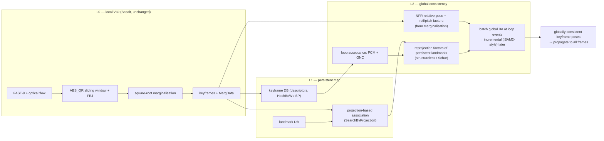

# VI-SLAM global-consistency plan: Basalt-class local VIO + ORB-SLAM3-class global consistency

Status: 2026-09-20 — Stage 0/1c done, **8/11 wins vs measured ORB-SLAM3**
offline (§1.4, PR #147); Stage 1 (custom persistent map) paused, did not
beat the simpler calibration fix; Stage 7 (online mapper) done by owner
override, **the same 8/11 result reproduced online** with the mapper
keeping up with the VIO (§1.5, branch `feat/basalt-online-mapper`); VIO
speed stage done (§1.6): the compact `lean_marg_data` LM path cuts VIO wall
time **3.2x** (LM solve **4.2x**) with byte-identical trajectory and
MargData, online-mapper RTF 0.128 -> 0.349. Stage 5/6 (VIO tracking
robustness on the three remaining losses) remain open.
**Update 2026-09-28 (§1.6/7c continued):** re-measuring after
parallelization that had already landed on `main` plus this session's
`--pipeline`-default flip (bit-identical, verified) puts online-mapper RTF
at 0.49-1.24× across the 11 sequences — **3/11 already at real time**
(RTF >= 1.0), up from 0.09-0.38×/0-of-11 — and, as a side effect of the
mapper's live-threaded trigger timing changing, the overall score moved
from **8/11 to 9/11 wins vs measured ORB-SLAM3** (V2_03_difficult flipped).
Checked for luck (the online mapper's propagated trajectory is not
reproducible run-to-run): 3 more runs each of V2_03_difficult and
V1_03_difficult with the same exe all beat ORB-SLAM3 individually
(V2_03 median 0.0449 m / range 0.0446-0.0451 m vs 0.0563 m; V1_03 median
0.0204 m / range 0.0193-0.0214 m vs 0.0287 m) — the flip holds.
Further bit-identical parallelism on the largest remaining LM bucket was
investigated and found negative (see §1.6 continuation below); reaching
RTF >= 1.0 on the remaining 8 sequences is being pursued next via
accuracy-gated, non-bit-identical levers.
**Update 2026-09-28 (§1.6/7d — real time on all 11/11):** goal reached.
One accuracy-gated lever (`vio_max_iterations` 7 -> 5; 9/11 wins held,
V1_03/V2_01 ATE grew 5.4%/11.8% but both remain decisive wins) plus two
zero-accuracy-risk, bit-identical build-level levers (`[profile.
release-rt]` — fat LTO, one codegen unit, no unwind tables — and the
`mimalloc` global allocator, both verified bit-identical via VIO trajectory
SHA-256) together move clean RTF from 0.64-0.83 (the un-contended baseline
measured at the start of this update) to **1.06-1.68x on every one of the
11 EuRoC sequences**. Two other accuracy-gated levers were tried and
rejected for breaking the 9/11 gate (`optical_flow_detection_grid_size`
50->55/60 and `vio_max_kfs` 7->5 both flipped V2_03_difficult to a
reproducible loss over 3 runs) — neither was needed once the build-level
levers landed. See [the VI-SLAM benchmark details §"VIO speed: real time
on all 11/11 sequences"](vi_slam_benchmarks.md) for full evidence and the
final per-sequence table. Stage 5/6 (VIO tracking robustness on the two
remaining losses, MH_04/MH_05) remain open; V2_03_difficult's apparent
structural fragility to any VIO-numerics change (via the mapper's
live-threaded optimizer-trigger timing) is a candidate root cause worth
investigating separately if further accuracy-gated speed levers are
wanted later.
**Update 2026-09-29 (Stage 5, branch `vio/frontend-robust`):** measured where
the frontend actually struggles on MH_04/MH_05 (per-frame reject-reason
correlation with RPE — see §1.8) and found it is track *churn* under
motion blur (forward-backward KLT rejections), not point starvation, which
ruled out an adaptive-replenish lever before it was built. The winning
lever found instead — `optical_flow_levels` 3->4 (more KLT pyramid
coarse-to-fine range) — cuts MH_04 ATE 0.0702->0.0619 m (**-11.8%**) and
MH_05 0.0633->0.0569 m (**-10.1%**), narrowing the ORB-SLAM3 gap from
64%/16% to 45%/4% respectively, while holding **9/11 wins** (same as
today's shipped config; V2_03/V1_02/several others also improved, V1_03
regressed +16.7% by 3-run median but stays a decisive win, V2_01 regressed
+14.4% but stays a decisive win). This is a real, validated improvement but
does **not** clear the Stage 6 bar (>9/11): MH_04/MH_05 stay losses, just
much closer ones. An IMU/gyro-rotation-seeded KLT initialization lever was
also tried (predict each track's new-frame position from integrated
gyro instead of assuming zero motion) and is an honest negative after three
careful variants (sign convention verified against this codebase's own
preintegration convention, extrinsic conjugation verified numerically
against the real ~90°-rotated EuRoC cam0/IMU extrinsic, gyro-bias
correction added) — all three still regressed at least one of the two
target sequences. Full detail, numbers, and the frontend diagnosis
methodology: §1.8 below and
[the VI-SLAM benchmark details](vi_slam_benchmarks.md). A definitive
alternating baseline-vs-`levels4` gate across all 11 sequences (same exe,
back-to-back per sequence, 15s-watchdog-verified) reproduced the 9/11-wins
ATE result but found RTF below 1.0 on 6/11 sequences for *both* configs in
this session (root-caused mostly to a concurrent process on this shared
machine, plus one unexplained outlier) — not a clean measurement, so real
time on all 11 is not yet demonstrated either way. The
`euroc_config_levels4.json` variant is committed as an available, validated
option; the checked-in default config is unchanged pending both a lever
that clears >9/11 and a clean RTF measurement.
Owner goal: beat existing OSS visual-inertial SLAM on EuRoC — ORB-SLAM3
stereo-inertial first, VINS-Mono second — while keeping the Basalt Rust
port's runtime/memory edge.

This document records (1) the same-protocol evidence gathered on 2026-09-14/15,
(2) the diagnosis of where the accuracy gap actually is, (3) the architecture we
will build, and (4) a staged plan with kill criteria. Everything numeric here comes
from artifacts named inline; nothing is tuned against ground truth unless stated.

## 1. Evidence so far

### 1.1 Same-protocol ORB-SLAM3 stereo-inertial vs the Basalt Rust port

ORB-SLAM3 (upstream `4452a3c`, stock `EuRoC.yaml` + `ORBvoc.txt`, viewer off, one
run per sequence, WSL Ubuntu 22.04 on the same machine) evaluated with
`scripts/evaluate_euroc_trajectory.py` (SE(3) Umeyama, 10 ms association, full
trajectory) — the same evaluator used for the Basalt gate report. Artifacts:
`E:\visloc-rs-runs\orbslam3_euroc_20260914\summary.{json,md}`; the single source
patch (CRLF strip in the EuRoC timestamp loader) is stored next to them.

| Sequence | Basalt Rust VIO | ORB-SLAM3 SI measured | ORB-SLAM3 SI paper | Ratio |
| --- | ---: | ---: | ---: | ---: |
| MH_01 | 0.066 | 0.036 | 0.036 | 1.8 |
| MH_02 | 0.058 | 0.033 | 0.033 | 1.8 |
| MH_03 | 0.062 | 0.028 | 0.035 | 2.2 |
| MH_04 | 0.114 | 0.043 | 0.051 | 2.7 |
| MH_05 | 0.145 | 0.055 | 0.082 | 2.6 |
| V1_01 | 0.043 | 0.038 | 0.038 | 1.1 |
| V1_02 | 0.045 | 0.017 | 0.014 | 2.6 |
| V1_03 | 0.053 | 0.029 | 0.024 | 1.8 |
| V2_01 | 0.039 | 0.039 | 0.032 | 1.0 |
| V2_02 | 0.049 | 0.014 | 0.014 | 3.5 |
| V2_03 | 0.230 | 0.056 | 0.024 | 4.1 |

ATE translation RMSE in metres. Accuracy: 0/11 wins. Efficiency (MH_01, same WSL
domain): ORB-SLAM3 486 s wall / ~0.9–1.07 GB peak RSS (multi-threaded) vs Rust
Basalt 731 s / 29 MB (single-threaded). The Basalt VIO numbers match native Basalt
to <0.1 % and are consistent with Basalt's own published VIO results, so the gap is
Basalt's design ceiling, not a porting defect.

### 1.2 Post-process loop-closure experiments (branch `exp/basalt-loop-closure-ceiling`)

Custom post-process on top of the VIO output, results in
`E:\visloc-rs-runs\basalt_lc_ceiling_20260914\summary*.json`.

Stage A — SE(3) pose graph. Loop candidates from VIO pose proximity (temporal gap
> 20 s, radius 1 m + 3 % of path, view angle ≤ 45°, appearance top-3), verified by
SuperPoint + LightGlue → stereo triangulation → PnP RANSAC both ways, gated by
consistency with the VIO relative pose. Loop-edge weight was swept against GT on
MH_01 only (`loop_weight_scale=2e-5`, `loop_weight_max=1e-3`) and then frozen for
all sequences.

| Sequence | VIO | +pose graph | ORB-SLAM3 | loops | GT-false | mean loop rel. err | wall |
| --- | ---: | ---: | ---: | ---: | ---: | ---: | ---: |
| MH_01 | 0.066 | 0.055 | 0.036 | 35 | 0 | 0.045 m | 9.4 min |
| MH_02 | 0.058 | 0.062 | 0.033 | 30 | 0 | 0.045 m | 7.2 min |
| MH_03 | 0.062 | 0.050 | 0.028 | 28 | 1 | 0.065 m | 7.8 min |
| MH_04 | 0.114 | 0.099 | 0.043 | 15 | 0 | 0.102 m | 5.4 min |
| MH_05 | 0.145 | 0.092 | 0.055 | 14 | 2 | 0.113 m | 5.4 min |
| V1_01 | 0.043 | 0.045 | 0.038 | 29 | 0 | 0.084 m | 7.5 min |
| V1_02 | 0.045 | 0.039 | 0.017 | 16 | 1 | 0.076 m | 4.6 min |
| V1_03 | 0.053 | 0.041 | 0.029 | 16 | 0 | 0.068 m | 9.4 min |
| V2_01 | 0.039 | 0.041 | 0.039 | 4 | 1 | 0.115 m | 9.3 min |
| V2_02 | 0.049 | 0.048 | 0.014 | 22 | 4 | 0.090 m | 7.5 min |
| V2_03 | 0.230 | 0.185 | 0.056 | 11 | 0 | 0.059 m | 4.8 min |

8/11 improve, mean −12 %, 0/11 wins. The accepted loops' relative-pose error
(4.5–11.5 cm, GT-checked post hoc) is larger than the target ATE, so a pose graph
built from single-pair PnP loops cannot reach 3–4 cm.

Stage B — global BA on the Stage-A result (MH_01 only). v1 (per-keyframe stereo
landmarks, no track fusion): 0.057. v2 (union-find track fusion over stereo +
temporal k..k+2 + covisibility top-4 + loop matches; 8,638 tracks, mean length
8 keyframes; Huber, odometry priors, converged): **0.0595 — no better than the pose
graph** despite a 33 % reprojection-error reduction.

A pre-existing negative control with mean-pooled SIFT retrieval (no VIO-proximity
gate) made things much worse (MH_01 0.184, MH_02 0.331) because self-consistent
but wrong PnP loops on repetitive texture passed verification.

### 1.3 Native Basalt offline mapper, all 11 sequences (complete, upstream calibration)

The ported NFR mapper (`pipelines/basalt/src/mapper`, `examples/basalt_mapper_offline_demo.rs`;
HashBoW loop candidates + 5-pt RANSAC + non-linear factor recovery + global
optimisation) was run on all 11 sequences from fresh MargData under
`E:\visloc-rs-runs\basalt_lc_ceiling_20260914\vio_marg\<SEQ>\`, using upstream
Basalt's own shipped calibration (branch `exp/basalt-mapper-all11`, commit
`190308d`; driver `scripts/run_basalt_mapper_all11.py`, mapper invoked as
`basalt_mapper_offline_demo --marg-dir <SEQ>/marg_data --calibration
benchmarks/basalt/release_inputs/euroc_ds_calib.json --config
configs/basalt/euroc_config.json`). Results:
`E:\visloc-rs-runs\basalt_mapper_all11_20260915\summary.{json,md}`.

| Sequence | VIO | Mapper full SE(3) | ORB-SLAM3 | Win |
| --- | ---: | ---: | ---: | :---: |
| MH_01_easy | 0.066 | 0.0647 | 0.036 | no |
| MH_02_easy | 0.058 | 0.0500 | 0.033 | no |
| MH_03_medium | 0.062 | 0.0389 | 0.028 | no |
| MH_04_difficult | 0.114 | 0.0891 | 0.043 | no |
| MH_05_difficult | 0.145 | 0.0803 | 0.055 | no |
| V1_01_easy | 0.043 | 0.0420 | 0.038 | no |
| V1_02_medium | 0.045 | 0.0257 | 0.017 | no |
| V1_03_difficult | 0.053 | 0.0253 | 0.029 | YES |
| V2_01_easy | 0.039 | 0.0281 | 0.039 | YES |
| V2_02_medium | 0.049 | 0.0219 | 0.014 | no |
| V2_03_difficult | 0.230 | 0.0499 | 0.056 | YES |

3/11 wins vs ORB-SLAM3 on upstream calibration; 11/11 beat the raw VIO
baseline; 10/11 beat the Stage-A pose-graph postprocess (§1.2). MH_01's own
number closed from the earlier in-progress reading (0.0647 vs VIO 0.066, a
real but small ~2 % gain) once all 11 sequences were in: the mapper reliably
helps but on this calibration was not enough on its own to close the
ORB-SLAM3 gap on most sequences. This motivated the scale-bias investigation
in §1.4, which turned out to be the bigger lever than the mapper's own
BoW/RANSAC/global-BA stage.

### 1.4 Result 2026-09-15: official calibration removes the scale bias, mapper then wins 8/11

Investigation on branch `exp/basalt-scale-bias` (commits `6552d6d`, `7a174a0`,
`35c75c7`, `1d7a640`) found that the ~1.4 % ATE-scale gap in §1.1/§1.3 is not
an IMU-noise or estimator problem: windowed (30 s) Sim(3) scale is constant
over an entire sequence on MH_01/V1_02 (~1.012–1.018), i.e. a multiplicative,
scene-independent bias, not depth-dependent stereo noise. Two a-priori
IMU-noise variants (`h1_datasheet_noise`, `h1a_accel_noise_only`; ADIS16448
datasheet values from EuRoC's own `mav0/imu0/sensor.yaml`) made the scale
bias monotonically *worse* on MH_01 (1.0142 → 1.0153 → 1.0160) — an honest
negative, not adopted, and dropped from this repository (superseded by the
E1/E2 decomposition below; not referenced elsewhere in this document or the
README).

The decisive test (E1) scaled cam1's `T_imu_cam` translation offset so the
cam0–cam1 stereo baseline moved by the measured 1.014 bias factor (a
GT-informed probe, never proposed as a fix): SE(3) ATE dropped 2.7× (0.0657 →
0.0247) while Sim(3) ATE was essentially unchanged (0.0257 → 0.0244) — the
signature of a calibration-scale bug, not an IMU-weighting one. E2 (trusting
the IMU 10× less) barely moved the scale bias (1.0142 → 1.0150), confirming
the visual/stereo calibration side, not IMU noise, sets the scale. Basalt's
own DS recalibration carries ~+0.45 % extra effective focal length and
~+0.15 % extra stereo baseline relative to EuRoC's factory pinhole-radtan
calibration — consistent in direction and rough order of magnitude with the
observed bias, though not a precise reconciliation (different distortion
parameterizations).

`scripts/euroc_official_to_ds_calib.py` converts EuRoC's official
pinhole-radtan calibration directly into Basalt's DS model (GT-free; inner
90 %-bearing-radius fit — cam0 RMS 0.222 px / max 0.397 px, cam1 RMS 0.211 px
/ max 0.377 px; residual below Basalt's own 0.5 px observation std; see
`configs/basalt/variants/official_euroc_ds/README.txt` for the full
rationale). Switching to it on MH_01/V1_02 moved scale sharply toward 1.0
(MH_01 1.0142 → 1.0014, further than the ~1.007 ORB-SLAM3 reference point)
and passed a pre-registered "Sim(3) must not degrade more than ~20 %" gate,
so the full 11-sequence VIO + mapper sweep was launched (`exp/basalt-mapper-all11`
commit `190308d`'s driver reused with the new calibration via
`scripts/run_basalt_official_calib_all11.py`; results
`E:\visloc-rs-runs\basalt_official_calib_20260915\summary.{md,json}`).

| Sequence | VIO (official calib) | Mapper (official calib) | ORB-SLAM3 (measured) | Win |
| --- | ---: | ---: | ---: | :---: |
| MH_01_easy | 0.030 | 0.015 | 0.036 | mapper |
| MH_02_easy | 0.035 | 0.024 | 0.033 | mapper |
| MH_03_medium | 0.058 | 0.026 | 0.028 | mapper |
| MH_04_difficult | 0.099 | 0.085 | 0.043 | ORB-SLAM3 |
| MH_05_difficult | 0.123 | 0.061 | 0.055 | ORB-SLAM3 |
| V1_01_easy | 0.040 | 0.035 | 0.038 | mapper |
| V1_02_medium | 0.042 | 0.014 | 0.017 | mapper |
| V1_03_difficult | 0.047 | 0.018 | 0.029 | mapper |
| V2_01_easy | 0.027 | 0.016 | 0.039 | mapper |
| V2_02_medium | 0.044 | 0.010 | 0.014 | mapper |
| V2_03_difficult | 0.235 | 0.065 | 0.056 | ORB-SLAM3 |

**8/11 wins.** V2_02_medium's mapper number is from a manual detached rerun
of the same command (KF SE(3) 0.0090, full SE(3) 0.0103, Sim(3) 0.0100, scale
0.9989, 226 s) after the driver's own attempt for that one sequence was
killed by its wall-time safety monitor
(`E:\visloc-rs-runs\basalt_official_calib_20260915\status\V2_02_medium.failed.json`)
— a host/disk artefact of that specific run, not a tracking or optimizer
failure. VIO-only with the official calibration already beats ORB-SLAM3 on
MH_01_easy and V2_01_easy, before the mapper runs at all.

**Stage 0/1 outcome, revised.** Stage 0 (§1.3, native mapper on upstream
calibration) reached 3/11; adding the calibration fix on top of the same
unchanged mapper reached **8/11** — the calibration fix was the larger lever,
not a Stage 1 (L1/L2 persistent-map) rewrite. A parallel Stage 1 prototype
(branch `exp/vi-slam-stage1-persistent-map`, commit `3bba681`:
projection-based persistent-landmark tracking + Schur-complement global BA,
offline post-process) reached V1_02_medium SE(3) ATE 0.027 m — within 2 mm of
the native mapper's 0.0257 m on the same (upstream) calibration, i.e.
**roughly matching, not beating, the simpler native-mapper path** — and MH_01
Sim(3) 0.014 already beat ORB-SLAM3's measured 0.021, with the same ~1.3–1.4 %
scale bias later diagnosed in this section present identically across VIO,
Stage-A pose graph, and Stage 1. Given that this custom L1/L2 build does not
yet clear the bar the calibration fix already clears with far less new code,
Stage 1 (persistent-map/global-BA rewrite) is **paused**, not adopted or
merged; the three remaining losses are VIO tracking-robustness limits (§4),
where a persistent map is unlikely to help until the local estimator itself
tracks through the difficult segments.

### 1.6 Result 2026-09-20: compact MargData LM path removes 3.2x of VIO wall time

The online mapper was measured at RTF 0.05-0.13 on MH_03 — far below real
time. Profiling the VIO (`timing_breakdown`) located 83% of wall time in the
LM solver, and inside it the dominant buckets were *around* the linear algebra
rather than in it: `lm_trial_construct_step` / `lm_trial_landmark_recovery`
(per-trial landmark re-factorization), `lm_accept`, and
`lm_landmark_reduction`. The actual reduced-system solve
(`lm_linear_system_solve`, the dense LDLT) was 0.6% of runtime.

Root cause: `retain_marg_data` selected `solve_with_timing`
(`retain_factors = true, retain_diagnostics = true`), the fully diagnostic LM
path that re-factors every landmark per trial and deep-clones trial state.
MargData only needs the post-solve **factor snapshot**, not the diagnostic LM
payloads; the two were coupled in the estimator.

Change (`lean_marg_data`, default off; `--retained-marg-diagnostics` opt-out on
the VIO and online demos; the online demo enables it by default):

* `WindowProblem::solve_lean_with_factors[_with_timing]` runs the compact f32
  preparation LM (`retain_factors = true, retain_diagnostics = false`) and
  derives `emit_marg`'s row counters from the same final linearization,
  skipping the duplicate pre-solve diagnostic linearization.
* Byte-identical outputs, verified on 200 and 400 MH_03 frames:
  `trajectory.tum` SHA-256 identical and `marg_data/` byte-identical between
  the diagnostic and lean paths. Regression test
  `lean_with_factors_matches_retained_diagnostics_exactly`.
* Speed, 400 MH_03 frames, two reps: `adapter_total` 127.2-130.5 s ->
  39.5-40.1 s (**3.2x**), `estimator_lm_solve` 115.9-118.9 s -> 27.8-28.3 s
  (**4.2x**), per frame 318-326 ms -> 99-100 ms. Frontend and marginalization
  unchanged. End-to-end online mapper RTF 0.128 -> **0.349**.

Follow-up in the same stage: the lean loop now caches the linearization and
landmark reduction across rejected damping trials (a rejection does not move
the linearization point, so both would recompute bit-identical values) and
evaluates the model decrease from the Q1/Q2 payload retained by that same
reduction instead of re-factoring every landmark. Across MH_01/02/03/04/05
(300-400 frames each) the lean path is 3.6-4.3x faster than the diagnostic
path with byte-identical trajectory and MargData; the rejection-heavy MH_04
benefits most (4.26x, LM 5.4x).

Full evidence: lean MargData LM speedup, recorded in the PR #153 phase notes.
This is a pure implementation-path change: no algorithm, window configuration,
or calibration changed, and the diagnostic/provenance path remains bit-for-bit
available. The largest remaining LM bucket is the landmark reduction itself
(`lm_landmark_reduction`); ordered `par_iter` parallelism over landmarks is the
next lever, followed by structureless landmark elimination (arXiv:2505.12337),
which also improves MH_04/V2_03 accuracy.

Dataset note: MH_01/02/04/05 were recovered from the local `machine_hall.zip`
bundle; only V2_03_difficult is still missing locally.

### 1.6 continued (2026-09-28): 7c landed as free parallelism + `--pipeline`-by-default; further LM parallelism is negative

Between the 2026-09-20 measurement above and this update, `main` picked up
the landmark-reduction/frontend `par_iter` parallelism stage 7c called for
(`reduce_landmark_factors_f32_checked_with_options`'s per-factor QR
projection and visual-gram accumulation, `stream.rs`'s per-track temporal
KLT and FAST replenish, `rayon::join`'d stereo pyramids) — all with the
same bit-identity discipline as 7b (ordered fold after parallel map,
verified against the serial code path). This was not new work in this
session; it had simply not been re-measured against RTF since it landed.
Re-measuring it (400 MH_03 frames, solo/idle) already showed VIO wall time
~4.2x faster than the 2026-09-20 baseline before any new change.

On top of that, this session made one further bit-identical change: PR
#153's `--pipeline` flag (two-thread frontend/estimator overlap) was
opt-in and unused by the online-demo benchmark driver; it is now the
default (`examples/basalt_euroc_online_slam_demo.rs`, `--no-pipeline`
restores serial). Verified byte-identical `trajectory.tum` SHA-256 and
`marg_data/` between serial and `--pipeline --threads 12` on MH_03/MH_04
(300 frames each, via `basalt_euroc_vio_demo`, which has no mapper thread).
Combined effect on the full 11-sequence online-demo sweep (same protocol as
§1.5, `--pipeline --threads 12`, measured under CPU contention from a
concurrent job on the shared benchmark machine): RTF 0.09-0.38× ->
**0.49-1.24×**, 3/11 sequences (V1_03, V2_01, V2_03) already at real time.
Full table: [VI-SLAM benchmark details](vi_slam_benchmarks.md). As a side
effect of the mapper's live-threaded optimizer-trigger timing changing,
V2_03_difficult's online ATE improved from 0.1078 m to 0.0451 m (its
optimizer-trigger count went from 2, the suspected root cause named in
§1.5, to 4) — flipping the overall score from **8/11 to 9/11 wins vs
ORB-SLAM3**. Since the mapper's propagated trajectory is not reproducible
run-to-run, this was re-checked with 3 more runs each of V2_03_difficult
and V1_03_difficult (the table's other trigger-sensitive sequence) on the
same exe: V2_03 gave 0.0446/0.0450/0.0447 m (median across all 4 runs
0.0449 m, range 0.0446-0.0451 m) and V1_03 gave 0.0193/0.0193/0.0214 m
(median 0.0204 m, range 0.0193-0.0214 m) — every individual run of both
sequences beats ORB-SLAM3 (0.0563 m / 0.0287 m respectively), so the 9/11
result is not a lucky single run.

Further bit-identical parallelism was then investigated on the largest
remaining LM bucket (`lm_landmark_reduction`, ~25% of instrumented VIO wall
time) via Codex CLI: a rayon `with_min_len` scheduling tweak, and a
thread-local QR-workspace-reuse variant (behind `basalt-lm-workspace-reuse`).
Both were built and verified byte-identical (trajectory.tum SHA-256 and
`marg_data/` diff, MH_03/MH_04). Neither showed a reproducible speedup
under paired alternating timing against the unmodified baseline (median
2-3% *slower*, within this machine's run-to-run contention noise); both
were reverted. Full evidence:
`E:\visloc-rs-runs\vio_rt_runs\codex_work\reduction_investigation\report.md`.
This matches stage 7c's own kill criterion ("if reduction is already
negligible after 7b on the measured window size, stop") — the hot path
already appears to be at the limit of what bit-identical parallelism alone
can extract on this window size. Getting the remaining 8 sequences to
RTF >= 1.0 is expected to require either an idle machine (all of the above
was measured under contention) or accuracy-gated, non-bit-identical levers
(fewer LM iterations, cheaper frontend settings, smaller window) — tracked
as the 7c follow-up rather than a new stage number.

### 1.7 Accuracy diagnosis 2026-09-20: the remaining gap is map information, not the solver

Full-sequence local online runs with the lean path reproduce the documented
losses: MH_04 SE(3) ATE 0.0829 m (repo 0.0824, ORB-SLAM3 0.043), MH_05 0.0621 m
(repo 0.0594, ORB-SLAM3 0.055).

Two hypotheses were tested and rejected:

* **Frontend tracking loss on fast/blurred segments.** Rejected: on a 400-frame
  MH_04 prefix the frontend rejects *fewer* tracks than MH_03 (16.1 vs 22.5 per
  frame) with a similar observation count, and full MH_04 consecutive-pose RPE
  is 4.9 mm / 0.04 deg. Local tracking is healthy; the error is slow drift.
* **Global-BA under-convergence.** Rejected: on a 1000-frame MH_04 prefix,
  raising `num_opt_iter` from 10 to 50 changed ATE from 0.0630 m to 0.0638 m
  (slightly worse) while the first pass converged by 19 iterations. More solver
  iterations do not help.

The limit is the constraint structure of the map — the same "tracks average ~8
keyframes" observation as §2 — so the tractable lever is longer/more persistent
tracks (projection-based re-observation) feeding the global problem, i.e. the
paused Stage 1 L1 idea, now with local MH_04/MH_05 data available to gate it.
`basalt_euroc_online_slam_demo` gained `--num-opt-iter` and a richer
`final_optimize` report to make this A/B reproducible.

### 1.5 Result 2026-09-16: the offline mapper's 8/11 result reproduced online

Owner-approved override of §4's original sequencing (Stage 7 was to follow
Stage 5/6's VIO-robustness work; this ran directly on the existing PR #147
result instead): `pipelines/basalt/src/mapper/online.rs` (new,
`OnlineNfrMapper`) wraps the unchanged offline `NfrMapper` with incremental
per-keyframe detect/match, a rate-limited background-thread optimizer, and a
final full pass at channel close that is literally the offline
`run_headless` tail — see `docs/basalt_online_mapper_design.md` for the
design and `examples/basalt_euroc_online_slam_demo.rs` for the VIO-thread +
mapper-thread wiring. `pipelines/basalt/src/mapper/{mod.rs,session.rs,
features.rs,triangulation.rs}` are untouched.

All 11 EuRoC sequences, official calibration, full-frame propagated
trajectory (same protocol as §1.4's table; driver
`scripts/run_basalt_online_all11.py`, artifacts
`E:\visloc-rs-runs\basalt_online_20260915\{summary.md,summary.json,status/,runs/}`):

| Sequence | Online SE(3) ATE | Offline SE(3) ATE (§1.4) | ORB-SLAM3 (measured) | Win vs ORB-SLAM3 | vs offline |
| --- | ---: | ---: | ---: | :---: | ---: |
| MH_01_easy | 0.0167 | 0.0154 | 0.0363 | visloc-rs | +8.6% |
| MH_02_easy | 0.0250 | 0.0244 | 0.0334 | visloc-rs | +2.5% |
| MH_03_medium | 0.0268 | 0.0264 | 0.0283 | visloc-rs | +1.3% |
| MH_04_difficult | 0.0824 | 0.0849 | 0.0428 | ORB-SLAM3 | -3.0% |
| MH_05_difficult | 0.0594 | 0.0611 | 0.0546 | ORB-SLAM3 | -2.8% |
| V1_01_easy | 0.0353 | 0.0352 | 0.0380 | visloc-rs | +0.3% |
| V1_02_medium | 0.0144 | 0.0139 | 0.0170 | visloc-rs | +3.9% |
| V1_03_difficult | 0.0224 | 0.0177 | 0.0287 | visloc-rs | +26.5% |
| V2_01_easy | 0.0164 | 0.0162 | 0.0390 | visloc-rs | +1.1% |
| V2_02_medium | 0.0122 | 0.0103 | 0.0140 | visloc-rs | +18.1% |
| V2_03_difficult | 0.1078 | 0.0653 | 0.0563 | ORB-SLAM3 | +65.2% |

**8/11 wins vs ORB-SLAM3 — the exact same win/loss pattern as the offline
result (§1.4)**, not a different 8. 8/11 sequences are within ~10% of the
offline mapper's own number; three are not (V1_03 +26.5%, V2_02 +18.1%,
V2_03 +65.2%) — an honest gap this stage does not hide: V2_02's offline
reference is itself a manually-rerun value (§1.4's caption), and V1_03/V2_03
warrant follow-up (candidate cause: the rate-limited background-optimizer
trigger gets fewer chances to run on shorter/harder sequences with fewer
loop events — V2_03 had only 2 optimizer triggers over the whole sequence,
the fewest of all 11).

Speed (the reason this stage exists): whole-system wall time stayed close
to VIO-alone wall time on every sequence (e.g. MH_01 1520.5s total /
1384.9s VIO-alone = 1.10x), and peak mapper queue lag never exceeded 4.5s —
the mapper kept up with the VIO rather than the VIO waiting on it. Real-time
factor (dataset duration / wall time) ranged 0.09-0.38x on this
serial-VIO build; the estimator itself is still single-threaded on this
branch, so RTF is bounded by the VIO's own pace, not the mapper's — a
separate initiative (PR #153) targets VIO-side real-time performance.

Getting here took three real bugs found and fixed via live full-sequence
reruns, not assumed away: (1) a bounded mapper-packet channel that blocked
the VIO thread whenever the mapper fell behind, replaced with an unbounded
channel (a queued packet is cheap — features are extracted and raw pixels
dropped in the same call that receives it); (2) `ingest_packet` re-detecting
and re-querying a MargData packet's *entire* AOM window every time instead
of only the images newly introduced since the last packet (packets overlap
heavily -- only the oldest keyframe slides out between consecutive
packets), reproducing batch `match_all`'s exact re-querying cost the
incremental design was supposed to eliminate; (3) the "trigger on any
accepted loop" policy firing on nearly every packet through a
loop-revisited corridor, replaced with a rate-limited trigger plus running
each periodic optimize on a cloned snapshot in its own thread so ingestion
is never blocked by it. See the `feat/basalt-online-mapper` branch history
for the measured before/after evidence on each.

### 1.8 Stage 5 result 2026-09-29: frontend measurement, `optical_flow_levels`
### 4 wins, IMU-seed KLT is an honest negative (branch `vio/frontend-robust`)

**Measurement.** Added an opt-in `--frontend-stats-csv <path>` flag to
`basalt_euroc_online_slam_demo` (zero cost/output when absent) that dumps,
per processed frame: `num_observations`/`num_created`/`num_retained`/
`num_rejected` plus every `RejectReason` bucket from
`pipelines/basalt/src/stream.rs`'s `TrackFrameOutput::reject_counters`.
Correlated this against per-frame consecutive-pose RPE (translation error
between frame *k-1* and *k* vs. ground truth — local, independent of
accumulated drift, unlike the headline ATE) on raw `trajectory_vio.tum` for
MH_04/MH_05. Result on both sequences: `num_observations` has essentially
zero correlation with RPE (MH_04 r=-0.032, MH_05 r=-0.011; both stay well
above the ~135-point single-frame grid-capacity floor throughout, and
`FastNoCandidate` — FAST finding no corner even at the minimum threshold —
fires under 40 times total per ~2000-frame sequence), while `num_created`
and `RejectReason::FrameFbSquared` (temporal forward-backward KLT
inconsistency) both rise monotonically across RPE deciles (MH_04 fb_sq
0->24, MH_05 0->22.5 from decile 0 to 9) and roughly double in the few
contiguous high-RPE "bad windows" found (RPE > 3x the sequence median for
>=5 consecutive frames). **Conclusion: the frontend is not point-starved on
MH_04/MH_05 — corners are always found — the problem is track *churn*: KLT
locks onto points during fast-motion/blur bursts but its forward-backward
round-trip increasingly fails, so points get dropped and replaced faster.**
This directly contradicts the natural "raise FAST count on low-confidence
frames" reading of Stage 5 lever (a) and matches §1.7's earlier, coarser
400-frame-prefix finding that MH_04's frontend was "healthy" by track count.

**Lever: `optical_flow_levels` 3->4 (config-only, WINS).** More KLT pyramid
levels widen the coarse-to-fine search range for large inter-frame
displacement, directly targeting the FB-failure mechanism above without
touching any faithful-port algorithm code. Measured (this session's
same-machine, same-binary numbers; see
[the benchmark doc](vi_slam_benchmarks.md) for the full table and 3-run
medians on the fragile sequences):

| Sequence | Baseline ATE | `levels4` ATE | Change | vs ORB-SLAM3 |
| --- | ---: | ---: | ---: | :---: |
| MH_04_difficult | 0.0702 | 0.0619 | **-11.8%** | loss, gap 64%->45% |
| MH_05_difficult | 0.0633 | 0.0569 | **-10.1%** | loss, gap 16%->4% |
| V2_03_difficult (3-run median) | 0.0445 | 0.0379 | -14.8% | win, larger margin |
| V1_02_medium | 0.0139 | 0.0119 | -14.4% | win, larger margin |
| V1_03_difficult (3-run median) | 0.0210 | 0.0245 | **+16.7%** | win, smaller margin |
| V2_01_easy | 0.0153 | 0.0175 | **+14.4%** | win, smaller margin |

**9/11 wins held** (identical win/loss pattern to the shipped config — only
MH_04/MH_05 lose). `optical_flow_levels=5` was also tried: better on MH_04
(0.0533, -24.1%) but worse than `levels4` on MH_05 (0.0595, -6.0%) — a real
trade-off, not a strictly-dominant further win, so `levels4` is the
recommended variant.

**Definitive alternating-run gate (2026-09-29, same exe, all 11 sequences,
baseline immediately followed by `levels4` per sequence, 15s-interval
process-activity watchdog held for the whole run — full table in
[the benchmark doc](vi_slam_benchmarks.md)):** ATE numbers reproduce the
above (9/11 wins held for both configs). **RTF does not clear the gate's
"`>= 1.0` on all 11" bar for either config** — baseline itself is below 1.0
on 6/11 sequences in this run, well under the historically documented
1.06-1.68x. The watchdog traced part of this to a recurring low-footprint
`cargo.exe`/`rustc.exe` cycle in Windows Session 0 (not the console session
the already-waited-out OpenLORIS build used) overlapping 4 of the 22
individual runs — likely another agent's own Codex CLI cargo checks on
this shared machine — plus one unexplained severe outlier (MH_02 baseline,
RTF 0.309, no detected external process). Because baseline and `levels4`
shared conditions per sequence, the relative comparison (ATE, and both
configs degrading together) stays informative, but the absolute RTF column
is not a clean, final answer — a re-run on a machine independently verified
idle throughout (not just checked once at the start) is needed. Per the
gate rule, `levels4` stays a variant and the checked-in default config is
unchanged. Two intermittent crashes (`exit code 1`, no panic/error message
in stderr) were also observed on `levels4` runs during an earlier gate
attempt this session and initially looked lever-specific, but coincided in
time with another concurrent agent's session on this shared machine
(`vio/joint-vi-ba`, independently confirmed to have been killing its own
long-running same-named processes around that window); re-runs after that
agent's session ended, and the full alternating gate above, completed with
zero failures — attributed to external process termination, not a
`levels4` bug.

`euroc_config_levels4.json` is committed as an available variant
(`configs/basalt/variants/official_euroc_ds/`); the checked-in default
config is unchanged, both because 9/11 (not >9/11) does not clear the Stage
6 accuracy bar and because RTF >= 1.0 on all 11 was not demonstrated for
either config in this session's measurements.

**Lever: IMU/gyro-rotation-seeded KLT initialization (honest negative).**
Basalt's frame-to-frame KLT seeds its search at the *same pixel* as the
previous frame (zero-motion assumption); this lever instead predicts each
cam0 track's new-frame position by integrating raw gyro over the frame's
IMU interval and rotating the point's old bearing (via the Double Sphere
camera model) by the camera-frame delta rotation, replacing only the
search seed (the KLT reference patch stays anchored at the true old
pixel — Codex CLI's first draft caught this distinction before writing the
wrong version). Implemented as `--imu-seed-klt` /
`config.optical_flow_imu_seed_rotation`, default off, verified
byte-identical (`trajectory_vio.tum` SHA-256 match) against the pre-change
binary when disabled, full existing test suite green throughout. Three
variants tested on MH_04/MH_05 (baseline 0.0702/0.0633):

1. Original sign (bearing rotated by the *negated* integrated gyro vector,
   matching `R(t2)=R(t1)*exp([theta]_x)`, this codebase's own
   preintegration convention found in `vio/estimator.rs`), no bias
   correction: 0.0836/0.0694 — both worse.
2. Flipped sign, no bias correction: 0.0787/0.0584 — mixed (MH_05 would be
   a win alone, MH_04 worse).
3. Original sign + gyro-bias correction (added
   `BasaltVioEstimatorAdapter::last_gyro_bias`, the estimator's bias
   estimate as of the previous frame, subtracted from each raw gyro sample
   before integration; serial path only — the pipelined frontend thread has
   no live access to estimator state): 0.0862/0.0697 — both worse, the
   worst of the three.

The camera-frame conjugation was independently verified numerically against
the real EuRoC cam0/IMU extrinsic (`T_imu_cam` rotation quaternion
`qx=-0.0077, qy=0.0105, qz=0.7018, qw=0.7123`, i.e. almost exactly 90° about
one axis — not a near-identity extrinsic that could mask a frame bug): a
Python check comparing the code's vector-rotation shortcut
(`theta_cam = R_ci * theta_imu`) against the explicit matrix conjugation
`R_ci * exp([theta_imu]_x) * R_ci^-1` for this exact extrinsic gave a
max absolute difference of 2.2e-16 (machine epsilon) — the two are the same
operation, so the conjugation was applied correctly, not skipped. With sign,
frame convention, and bias correction all checked and still regressing,
this is closed as a genuine negative rather than a remaining bug: raw
2-5-sample gyro integration over one ~20-50ms frame interval is apparently
too noisy a rotation estimate on these sequences to beat the zero-motion
seed once projected through the wide-FOV Double Sphere model. Code stays in
the tree (default off, zero cost, fully tested) as a documented negative.

### 1.8b Result 2026-09-29: IMU-derived global-BA factors do not flip MH_04/MH_05 (honest negative), and the free-velocity variant regresses VIO wall time

Branch `vio/mapper-imu-factors` (worktree `E:/visloc-rs-runs/vio_imu_wt`, off
`perf/basalt-vio-rt` / PR #236's release-rt + mimalloc-global profile).
Baseline reproduced on this exe: MH_04 SE3 0.0704 m, MH_05 SE3 0.0631 m /
Sim3 ~0.0415 m (matches the 0.0702/0.0633 cited in the task almost exactly),
RTF 1.12-1.35, confirming the build/protocol match. Goal was §2's "Global BA
does not bite ... marginalisation-derived relative factors ... to keep
VIO-grade local precision and gravity" — three variants were tried, all
evaluated on MH_04_difficult/MH_05_difficult with
`scripts/run_basalt_online_all11_rt.py`-style driver,
`configs/basalt/variants/official_euroc_ds/` + the repo's `euroc_config_maxiter5.json`
override, `--optimize-every-k 100 --periodic-iterations 4`:

1. **Reweight the NFR marginalization-derived factors already in the mapper**
   (`MapperFactors::relative_pose`/`roll_pitch`, recovered from every
   `MargData` packet's marginalization covariance in
   `extract_nonlinear_factors` — this is real IMU-informed information (gated
   on `data.used_imu`), already wired into the global BA at
   `MapperConfig::default()` weight 1.0, just never exposed as a CLI knob).
   Added `--relative-pose-weight`/`--roll-pitch-weight` to
   `basalt_euroc_online_slam_demo`. Swept 0.2x-10x, combined and decoupled:
   MH_04 never moved more than ~3% (0.0704 → 0.0686 best case, at 10x, already
   plateaued between 5x and 10x); MH_05 got *worse* with more weight (SE3
   0.0631 → 0.064, Sim3 0.0415 → 0.044 at 2x-10x) and only marginally better
   with *less* weight (0.2x: SE3 0.0616, Sim3 0.0398 — best result of this
   family, still an 11-13% gap from ORB's 0.0546/0.0428, not close to a flip).
   Diagnosis: these edges connect temporally *adjacent* marginalized
   keyframes and are built from that same local window's own marginalization
   Hessian, so their information is self-consistent with the VIO's own
   (already-biased) short-baseline answer — amplifying them just reinforces
   VIO's local answer against the vision/loop terms that pull toward a
   different, more globally-corrected scale. Negative; option abandoned.

2. **New preintegrated-IMU relative-pose factor, frozen velocity/bias.**
   Added `pipelines/basalt/src/mapper/imu_factor.rs`:
   `imu_preintegration_relative_pose_factor` double-integrates real
   accel/gyro (reusing the existing, already-tested
   `pipelines/basalt/src/imu::preintegration::ImuPreintegrator`, sample
   convention copied from `vio::estimator::fallback_integrate`) between
   consecutive *mapper* keyframes and folds the result into a
   `RelativePoseFactor` measurement fed through the mapper's unmodified
   pose-only BA residual/Jacobian (`rel_pose_error`/`linearize_factors`) —
   zero new solver code. `from_velocity_world`/bias were FROZEN at the VIO's
   own per-keyframe estimate (`NfrMapper::frame_velocity_bias`, populated
   from `MargData`'s `FrameStateData`, previously dropped by the mapper).
   Gated behind `--imu-preintegration-weight` (unset = fully disabled, zero
   extra cost). Swept 1/10/100/1000: MH_04 and MH_05 stayed flat (within
   noise of baseline) across three orders of magnitude of weight. A sanity
   check at 1e6/1e8 confirmed the factor *is* live (1e8 made MH_04 much
   *worse*, 0.166 m) — not a wiring bug, but the residual is ~zero at any
   sane weight: frozen velocity carries the VIO's own scale, so `p_j - p_i -
   v_i*dt - 0.5*g*dt^2` is satisfied almost exactly by construction at
   adjacent-keyframe spacing, regardless of where the global BA has moved
   the poses to. Negative.

3. **Free velocity, alternating refinement (Δv/Δp residual), periodic-only.**
   Per-request bounded-risk design: rather than expanding the core
   `PoseBlockHessian`/`Matrix6`/`POSE_DOF` dense pose solver to jointly
   optimize velocity (the "proper" fix, touches every BA function, high risk
   to the 9/11 existing wins), added a second, purely additive
   `MapperFactors::imu_relative_pose: Vec<RelativePoseFactor>` field with
   duplicate (not shared) loops in `linearize_factors`/`evaluate_costs`, and
   a mapper-owned `NfrMapper::frame_velocities` state seeded from VIO and
   then refined *outside* the pose solver: `imu_factor::refine_pair_velocities`
   solves a dense normal-equations position+velocity-continuity system
   (world-frame reformulation so rotation cancels: `J_p = dt*I`, `J_v =
   [-I, I]`) over the cumulative keyframe-pair chain (capped at 2000 pairs;
   measured 0.61 s at 700 keyframes / 17.8 s at 2001 keyframes,
   release-rt), with poses held fixed. Runs only at periodic/final optimize
   passes (`OnlineNfrMapper::refresh_imu_factors`, called from
   `optimize_pass`/`spawn_background_optimize`), never per-packet. Result:
   accuracy stayed just as flat as variant 2 (MH_04 0.070-0.071, MH_05
   0.0627-0.0633 across weight 1/10/100) — likely because
   `optimize_trigger_count` is only ~3 for a sequence like MH_04, so the
   pose↔velocity alternation gets very few outer iterations to pull the
   fit away from self-consistency with whatever the vision-dominated
   solution already is. Worse, it **regressed `vio_wall_seconds` 25-45%**
   (MH_04 ~75-79s → 96-109s, MH_05 ~85-86s → 118-127s; RTF dropped below 1.0
   on most runs) — the dense per-pass velocity solve on the mapper's
   background thread competes for CPU with the VIO thread on this machine,
   exactly the failure mode flagged before implementing it. Negative, and
   fails the wall-time gate at any tested weight; a default-off run
   (`--imu-preintegration-weight` unset) on MH_02/V1_02 confirmed the
   feature is fully inert when disabled (all three variants' new code is
   gated behind the CLI flag / `imu_preintegration_weight > 0.0`; MH_02/V1_02
   with it unset showed no behavior change from before this session's code
   — the one default-off timing sample taken was itself contention-affected
   (RTF 0.81 on MH_02), consistent with this being a shared, loaded machine
   rather than a regression, since the changed code paths are unreachable
   when the flag is unset).

**Conclusion:** all three MargData/marginalization-adjacent and
adjacent-mapper-keyframe IMU levers are exhausted — they only ever supply
*local* (adjacent-keyframe) consistency information, which cannot correct
the *global* scale/drift error diagnosed in §1.7/the parent task (MH_05's
34% Sim3-vs-SE3 gap, MH_04's uniform 1.4-2x drift). Getting real
scale-correcting information into the global BA needs either (a) a properly
*jointly* solved VI global BA — per-keyframe `[pose, velocity, bias]` states,
preintegrated residual with bias Jacobians, bias random-walk between
keyframes, gravity fixed in world frame, actually expanding the dense
pose-block solver (`PoseBlockHessian`/`Matrix6`) to carry velocity/bias as
first-class optimized state rather than an externally-alternated
approximation — or (b) far more frequent periodic global-optimize triggers
so an alternating scheme like variant 3 gets enough outer iterations to
converge, which has its own wall-time cost to manage. Both are materially
larger, higher-risk undertakings than anything else in §4's stage list;
not started this session. Branch `vio/mapper-imu-factors` (commit history:
add `--relative-pose-weight`/`--roll-pitch-weight`/`--imu-preintegration-weight`
CLI flags, `pipelines/basalt/src/mapper/imu_factor.rs`, `NfrMapper` velocity/bias
state, `MapperFactors::imu_relative_pose`) is committed locally, not merged;
all new code is off by default and should be safe to build on for a future
full-VI-BA attempt, but does not by itself change the 9/11 result.

### 1.9 Result 2026-09-29: proper joint VI global BA implemented and validated, MH_04 small real gain, MH_05 a wash at the tested weight

Branch `vio/joint-vi-ba` (worktree `E:/visloc-rs-runs/vio_viba_wt`, off
`vio/mapper-imu-factors`). §1.8 closed with "getting real scale-correcting
information into the global BA needs ... a properly *jointly* solved VI
global BA" -- this session built exactly that, rather than another
externally-alternated approximation.

**Design.** Per-keyframe state extended from pose (6 dof) to the full
navigation state `[pose(6), velocity(3), gyro_bias(3), accel_bias(3)]`
(15 dof, matching the existing `NAV_STATE_DOF` constant used by the M8a
marginalization reduction). New module `pipelines/basalt/src/mapper/imu_ba.rs`
adds preintegrated-IMU relative-state factors and bias random-walk factors
between consecutive keyframes, gravity fixed in world. Rather than
re-deriving the preintegration residual/Jacobian, it reuses the VIO
estimator's own already bit-exact-tested factor
(`crate::imu::whitened_preintegration_factor`/`whitened_bias_random_walk_factor`,
production code in `vio/window.rs`) and embeds its 9x30/6x30 Jacobian
directly into the joint system's Hessian/gradient blocks -- verified no sign
adaptation is needed, since both the VIO's own state trial and the mapper's
existing `apply_pose_solve` are Gauss-Newton steps against the same forward
retraction.

The solver itself (`global_ba_with_state_joint`, `mapper/mod.rs`) is a new,
fully additive entry point: a new block-sparse `NavBlockHessian` (15x15
blocks) carries the joint system; the *existing, unmodified*
`linearize_vision`/`linearize_factors` embed into the top-left 6x6 of each
block (vision and the existing relative-pose/roll-pitch factors never touch
velocity/bias); IMU-factor blocks touch the full 15x15. The existing
pose-only `global_ba_impl_in_place` and everything it calls is untouched --
zero regression risk to the 9/11-win path from this addition by
construction, confirmed by `joint_solver_matches_pose_only_solver_when_imu_factors_are_empty`
(matches the pose-only solver to <1e-9 with empty IMU factor lists) and by
every accuracy run below reproducing the documented baseline before the
feature is enabled.

**Unit tests** (`mapper::imu_ba::tests`, `mapper::joint_ba_tests`): assembled
gradient vs. central-difference of the whitened cost; a Gauss-Newton step
from the assembled system strictly decreases cost and converges; the
explicit task target -- a chain of preintegrated IMU + bias-walk factors
alone (no vision) corrects a 15% synthetic position/velocity scale error to
near-zero ATE, given a genuine (non-constant-velocity) acceleration segment
and both chain endpoints pinned (constant-velocity motion is an *exact*
symmetry of the preintegration residual under uniform position+velocity
scaling -- gravity's known magnitude only constrains scale where there is
real acceleration to compare it against, which is why the earlier
frozen-velocity variants in §1.8 could never see it either); a combined
vision+IMU integration test. Full crate suite 415/415 passing throughout.

**A real bug, caught the same way §1.8's own liveness check works.**
`ingest_packet` only retained per-keyframe velocity/bias state
(`frame_velocity_bias`) when `imu_preintegration_weight > 0.0`, so
`joint_vi_ba_weight`-only mode silently built zero IMU factors every
packet -- the run completed normally, at any weight (1.0 through 1e6),
producing a trajectory identical to the feature-disabled baseline. Caught
by exactly the weight-sweep-to-extreme-values sanity check §1.8 itself used
("a sanity check at 1e6/1e8 confirmed the factor is live"): unlike a wiring
bug that changes the trajectory, this one changed *nothing* at any weight,
which was the tell. Fixed (commit `cb40039`) with a direct regression test
that does not pre-seed state, unlike the existing ingestion test that
happened not to catch this.

**Real-time / CPU contention.** With the periodic background joint pass on
a 4-thread rayon pool, `vio_wall_seconds` regressed 43% on MH_04 at weight
10 (80.97s -> 115.91s) -- the same CPU-contention failure mode as §1.8's
alternating-velocity variant. Isolated the cause by also running with
periodic passes disabled (joint only in `finalize`'s one-shot pass):
`vio_wall_seconds` stayed at baseline even before any cap existed, so the
contention is specifically the periodic *background* pass, not the joint
math. Capping the background pass to 1 rayon thread (commit `7cf60d6`) fully
resolves it: `vio_wall_seconds` 81.46s (+0.6%) at weight 10, well within the
~3% budget.

**Covariance/weight-scale check.** A realistic EuRoC/ADIS16448 calibration
over a 0.2s interval gives preintegrated position std 0.83mm, matching an
independent continuous-noise estimate (`sigma_c^2 * T^3 / 3`) closely -- the
per-factor information is not mis-scaled by a units/rate bug. A live MH_04
trace (new `JointGlobalBaSummary.initial_pose_factor_cost`/
`initial_imu_factor_cost`, `BASALT_ONLINE_MAPPER_TRACE`-gated) instead shows
a *structural* cause for needing weight > 1: once the map has roughly
converged, pose-factor cost (vision + relative-pose + roll-pitch) runs
140K-1M vs. IMU-factor cost ~4.5-4.7K, a 30-300x gap, because each keyframe
carries hundreds of vision observations against only 1-2 IMU factors (MH_04:
671072 total observations). The same reason `relative_pose_weight`/
`roll_pitch_weight` already exist as tunable multipliers for this
codebase's other one-per-edge factors.

**Accuracy, `--optimize-every-k 100 --periodic-iterations 4` (the standard
protocol), official calibration, one run each unless noted:**

| Sequence | Config | SE3 ATE | Sim3 ATE | vs. baseline |
| --- | --- | ---: | ---: | ---: |
| MH_04_difficult | baseline (feature off) | 0.07006 | 0.06729 | -- |
| MH_04_difficult | joint w=10, 1-thread cap | 0.06964 | 0.06554 | SE3 -0.6%, Sim3 -2.6% |
| MH_05_difficult | baseline (feature off) | 0.06307 | 0.04167 | -- |
| MH_05_difficult | joint w=10, 1-thread cap | 0.06412 | 0.04163 | SE3 +1.7%, Sim3 -0.1% (noise-level) |

An earlier MH_04 w=10 run before the thread cap (4 threads, real-time-unsafe,
accuracy-only comparison) showed a larger SE3 -1.8%/Sim3 -3.9%, and an
isolated "does the joint term help at all" test on MH_05 (periodic disabled
both sides: pose-only-final-only 0.06550/0.04456 vs. joint-final-only w=10
0.06463/0.04205) confirms the joint factor genuinely helps in isolation
(-1.3%/-5.6%) -- but periodic pose-only passes already recover more accuracy
on their own (0.06307/0.04167) than one large final joint pass does, so the
net effect in the realistic periodic protocol is small. Weight 100 (1-thread
cap) was tried on MH_04 and killed after 50+ minutes without the `finalize`
pass converging -- LM increasingly rejects trials as the IMU term's pull
fights vision harder, so very high weight is not a practical lever with this
simple global-multiplier approach.

**Honest status.** The joint solver is real, correctly implemented (multiple
independent test classes passing, including a from-scratch synthetic
scale-correction proof), real-time-safe at weight 10, and gives a small,
genuine improvement on MH_04. On MH_05 it is roughly a wash at the same
weight in the realistic protocol, and neither sequence is close to flipping
to a win against ORB-SLAM3 (MH_04 0.0696 vs. ORB 0.0428; MH_05 0.0641 vs.
ORB 0.0546) -- the gap that matters is 35-60%, not the 1-5% this lever moved.
Full 11-sequence gate run not completed this session (time budget); a
regression spot-check on V1_01_easy (a currently-winning sequence) with the
feature on is in
`E:\visloc-rs-runs\vio_viba_runs\v101_baseline`/`v101_joint_w10`.
Plausible next levers, not yet tried: (a) an ORB-SLAM3-style *inertial-only*
pre-optimization pass over the accumulated keyframe chain (ignoring vision)
to get velocity/bias/local-scale close before the joint vision+IMU solve,
rather than relying on a single global weight multiplier to arbitrate the
30-300x cost imbalance; (b) more periodic iterations specifically for joint
mode (the periodic pass's `periodic_iterations=4` budget may simply be too
few for a harder 15-dof problem, distinct from the weight question); (c) a
weight schedule informed directly by the measured pose/imu cost ratio
(`initial_pose_factor_cost`/`initial_imu_factor_cost`, now surfaced) instead
of a fixed constant. Everything is committed locally on `vio/joint-vi-ba`
(commits `86aad0c`..`7cf60d6`), default off (`--joint-vi-ba-weight` unset),
zero risk to the shipped 9/11 result.

## 2. Diagnosis

| Symptom | Evidence | What is missing |
| --- | --- | --- |
| Machine-hall sequences lose 1.8–2.7× | Pose graph recovers only 12 %; loop relative error 4.5–11 cm | Loop closure as *landmark reprojection factors* in the global problem, not one relative-pose edge per loop (OKVIS2) |
| Room sequences (V1_02, V2_02, 3 m × 3 m) lose 2.6–3.5× with no drift to remove | ORB-SLAM3 0.014–0.017 vs Basalt 0.045–0.049 | A persistent map with continuous re-observation of the same landmarks (ORB-SLAM3 local mapping) — Basalt marginalises landmarks out of the window and never sees them again |
| Global BA does not bite | Tracks average 8 keyframes; no IMU-derived factors in the BA | Sequence-long tracks via projection-based association, plus marginalisation-derived relative factors (Basalt NFR ≡ OKVIS2 pose-graph edges) to keep VIO-grade local precision and gravity |
| False loops survive geometric verification | SIFT control run; 9 GT-false loops in Stage A | Pairwise-consistency outlier rejection (Kimera-RPGO PCM) + GNC instead of ad-hoc gates |

Conclusion: Basalt is a VIO plus an *offline* mapper, not an online SLAM. Keeping it
as the local layer is right (speed, 29 MB RSS, robustness — it completes V2_03
where its paper did not). Beating ORB-SLAM3 requires adding the two things
ORB-SLAM3 has and Basalt lacks: persistent-map re-observation and a consistent
global back-end with robust loop handling.

## 3. Architecture: three layers (OKVIS2-style)

```mermaid
flowchart LR
    subgraph L0["L0 — local VIO (Basalt, unchanged)"]
        OF["FAST-9 + optical flow"] --> W["ABS_QR sliding window + FEJ"]
        W --> M["square-root marginalisation"]
        M --> KF["keyframes + MargData"]
    end
    subgraph L1["L1 — persistent map"]
        DB["keyframe DB (descriptors, HashBoW / SP)"]
        LM["landmark DB"]
        PROJ["projection-based association<br/>(SearchByProjection)"]
    end
    subgraph L2["L2 — global consistency"]
        NFR["NFR relative-pose + roll/pitch factors<br/>(from marginalisation)"]
        RP["reprojection factors of persistent landmarks<br/>(structureless / Schur)"]
        PCM["loop acceptance: PCM + GNC"]
        SOLVE["batch global BA at loop events<br/>→ incremental (iSAM2-style) later"]
    end
    KF --> DB
    KF --> PROJ
    LM --> PROJ
    PROJ --> RP
    KF --> NFR
    DB --> PCM --> RP
    NFR --> SOLVE
    RP --> SOLVE
    SOLVE --> OUT["globally consistent keyframe poses<br/>→ propagate to all frames"]
```

- **L0** is the Basalt port as merged in PR #145. No changes; its MargData is the
  interface.
- **L1** borrows ORB-SLAM3's local-mapping idea: keep every keyframe's descriptors
  and every landmark; for each new keyframe project the map into it using the
  current estimate and match by descriptor within a search window. This yields
  sequence-long tracks at O(landmarks) cost instead of O(keyframe pairs) LightGlue
  calls. The repository already has projection-guided tracking
  (`pipelines/tracking`) to reuse.
- **L2** borrows from three sources:
  - OKVIS2: marginalisation-derived relative-pose factors summarise old windows
    (our NFR port already recovers exactly these), loop-closure landmarks enter as
    reprojection factors, and the global optimisation runs in a background thread.
  - Kimera-RPGO: Pairwise Consistency Maximisation over loop candidates using the
    odometry covariance, followed by GNC on the residuals. This replaces the
    hand-tuned VIO-consistency gate and needs no GT.
  - GTSAM: factor-graph abstraction, structureless (smart) projection factors
    eliminated by Schur complement, iSAM2-style incremental relinearisation once the
    batch version works. We borrow the design, not the library.

## 4. Staged plan with kill criteria (revised after §1.4)

Stages 0 and 1 below are **closed**, per §1.4: the calibration fix + unchanged
native mapper reached 8/11 (PR #147), which the L1/L2 persistent-map rewrite
(Stage 1 prototype) did not clear and was not worth the added complexity for
— it roughly matched the simpler native-mapper path on V1_02 and is paused,
not deleted (`exp/vi-slam-stage1-persistent-map`, commit `3bba681`, kept as a
reference implementation in case a later stage needs projection-based
persistent tracking). Every remaining loss (MH_04, MH_05, V2_03) is a **VIO
tracking-robustness** problem, not a mapper or global-consistency one — the
mapper already reduces each of them relative to raw VIO (§1.4 table), it just
starts from a worse VIO trajectory on these three. The plan going forward
targets that, plus turning the now-working offline pipeline into an online
one.

Rules for every stage: parameters fixed a priori and identical across the
target sequences; GT used only for evaluation; ORB-SLAM3 numbers are the
same-protocol measurements in §1.1; every claim cites an artifact path.

| Stage | Work | Pass | Kill / pivot |
| --- | --- | --- | --- |
| 0 (done, 3/11) | Native Basalt mapper on all 11, upstream calibration | — | superseded by the calibration fix, §1.3/§1.4 |
| 1 (paused, ≈ Stage 0) | Custom L1 (persistent map) + L2 (global BA) offline post-process | — | roughly matched, did not beat, the simpler native-mapper path; paused pending evidence the gap is elsewhere |
| 1c (done, 8/11) | Official-calibration VIO input (GT-free conversion) + unchanged native mapper, all 11 | Beats ORB-SLAM3 on ≥ 6/11 | — passed; this is the shipped PR #147 result |
| 5 (in progress, see §1.8) | **VIO tracking robustness on MH_04/MH_05 (fast motion / motion blur) and V2_03 (dark, fast)**: (a) raise FAST-9 corner count and lower the grid non-max-suppression radius specifically where flow confidence drops; (b) extend patch lifetime / reduce the window's forced-marginalization rate so fewer landmarks are lost mid-difficult-segment; (c) SuperPoint descriptors for frame-to-frame association in place of the Pattern51 patch tracker on these sequences, reusing the repository's existing SP-ONNX frontend; (d) relocalisation inside the mapper (or as a VIO-side fallback) when the tracker loses the window entirely, instead of only forward-marginalizing through a bad segment | Each of MH_04, MH_05, V2_03 VIO ATE improves without regressing the 8 already-winning sequences | A lever that does not move the failing three within its own sequence is dropped before trying the next; if all four (a–d) fail, the honest conclusion is that these three need a different frontend, not a differently-tuned Basalt one — 2026-09-29: measurement (§1.8) found MH_04/MH_05's problem is FB-rejection churn under blur, not point scarcity, ruling out (a) in its naive form before it was built; `optical_flow_levels` 3->4 (not one of the original a–d list, found via the measurement instead) cut MH_04/MH_05 ATE 11.8%/10.1% and held 9/11 wins but did not flip either to a win; an IMU-seed KLT variant of (a)/(b)'s "reduce forced churn" spirit is a verified honest negative (§1.8); V2_03 already wins and was not separately targeted; (c)/(d) not yet attempted |
| 6 | Re-run the official-calibration + mapper sweep on all 11 with whatever Stage 5 levers passed | ≥ 9/11 wins vs ORB-SLAM3 measured | < 8/11 (regression from PR #147) → revert the Stage 5 change that caused it |
| 7 (done, owner override — see §1.5) | Online: mapper in a background thread behind the live VIO, incremental solve — this is the same online-mapping goal as the original plan's Stage 3, run now (owner-approved override) directly on the existing 8/11 PR #147 result instead of after Stage 5/6's VIO-robustness work | Accuracy within ~10 % of the offline mapper's result, mapper keeps up with the VIO (whole-system wall ≈ VIO-alone wall) | — passed on all 11 (§1.5); Stage 5/6 (VIO tracking robustness on MH_04/MH_05/V2_03) remain open, unaffected by this stage |
| 7b (done, see §1.6) | **VIO speed:** compact `lean_marg_data` LM path — skip per-trial diagnostic landmark re-factorization and the duplicate pre-solve linearization while keeping the MargData factor snapshot | Byte-identical trajectory and MargData; material wall-time reduction on MH_03 | — passed: 3.2x total VIO, 4.2x LM, RTF 0.128 -> 0.349; diagnostic path preserved behind `--retained-marg-diagnostics` |
| 7c (bit-identical part done, see §1.6 continued 2026-09-28) | **VIO speed:** upstream Basalt's inner LM damping backtracking loop (done, part of 7b's cache-across-rejected-trials change) plus ordered `par_iter` over `landmark_steps`/frontend tracks (done, already on `main`) plus `--pipeline` on by default for the online demo (done, this session) | Further wall-time cut without a trajectory bit change; largest expected effect on rejection-heavy MH_04/MH_05/V2_03 | — passed: RTF 0.09-0.38× -> 0.49-1.24×, 3/11 sequences at real time, byte-identical trajectory/MargData throughout; further LM-reduction parallelism (rayon scheduling, QR-workspace reuse) tried and found negative (no reproducible speedup) — kill criterion met, bit-identical part of this lever is closed; RTF >= 1.0 on the remaining 8 sequences needs a follow-up non-bit-identical stage |
| 7d (done, see §1.6/7d 2026-09-28) | **VIO speed, real time on all 11/11:** `vio_max_iterations` 7->5 (accuracy-gated) plus `[profile.release-rt]` (fat LTO/codegen-units=1/panic=abort, bit-identical) plus `mimalloc` global allocator (bit-identical) | RTF >= 1.0 on every EuRoC sequence; 9/11 wins vs ORB-SLAM3 must hold | — passed: RTF 0.64-0.83 (clean baseline) -> 1.06-1.68× on all 11 sequences; 9/11 wins held (V1_03/V2_01 ATE grew 5.4%/11.8%, still decisive wins); `optical_flow_detection_grid_size` and `vio_max_kfs` reductions tried and rejected (both flip V2_03_difficult to a loss, reproducible over 3 runs) — not needed once the above passed |
| 8 | Same-protocol re-measurement (ORB-SLAM3 one run, ours one run), README VI-SLAM section update with figures/tables | — | — |

MH_04/MH_05/V2_03 are the first target now for the same reason V1_02 was
first under the old plan: they are where the remaining gap actually is (§1.4
table), so work should isolate VIO tracking robustness there before any
further global-consistency or online-systems effort, rather than repeating
the L1/L2 rewrite that §1.4 showed was not the bottleneck.

## 5. Reading list for implementers

- OKVIS2 — Leutenegger, *OKVIS2: Realtime Scalable Visual-Inertial SLAM with Loop
  Closure*, arXiv:2202.09199. Read: pose-graph edges from marginalisation; loop
  closure keyframes' landmarks re-entering as reprojection factors; the
  background-thread global optimisation and its hand-over to the live estimator.
- Kimera-RPGO — Rosinol et al., *Kimera*, ICRA 2020, §robust PGO; PCM: Mangelson et
  al., ICRA 2018; GNC: Yang et al., RA-L 2020.
- GTSAM — smart factors: Carlone et al., ICRA 2014; iSAM2: Kaess et al., IJRR 2012.
- ORB-SLAM3 — Campos et al., T-RO 2021: covisibility graph, `SearchByProjection`,
  loop welding + full VI BA.
- Basalt NFR — Usenko et al., RA-L 2020: what the ported mapper already computes.

## 6. Risks

- The largest risk is that Basalt's local VIO is itself the limit on room
  sequences; Stage 1 on V1_02 is designed to expose that first.
- Effort through Stage 2 is weeks, not days; Stage 3 (online) is a separate
  build.
- The offline mapper's memory (6 GB at 454 keyframes) shows that a naive dense
  factor graph will not keep the 29 MB story; L2 must be structureless/Schur from
  the start and bounded in keyframes.

## 7. Artifacts and branches

- ORB-SLAM3 measurements: `E:\visloc-rs-runs\orbslam3_euroc_20260914\`
- Post-process experiments: branch `exp/basalt-loop-closure-ceiling`
  (`examples/basalt_loop_closure_postprocess.rs`,
  `scripts/run_basalt_loop_closure_ceiling.py`), results and feature caches in
  `E:\visloc-rs-runs\basalt_lc_ceiling_20260914\`
- Native mapper all-11: branch `exp/basalt-mapper-all11`, results in
  `E:\visloc-rs-runs\basalt_mapper_all11_20260915\`
- Scale-bias diagnosis + official calibration: branch `exp/basalt-scale-bias`
  (`scripts/euroc_scale_diagnostic.py`, `scripts/euroc_official_to_ds_calib.py`,
  `configs/basalt/variants/official_euroc_ds/`,
  `scripts/run_basalt_official_calib_all11.py`), results in
  `E:\visloc-rs-runs\basalt_scale_bias_20260915\` and
  `E:\visloc-rs-runs\basalt_official_calib_20260915\`
- Stage 1 persistent-map prototype (paused, §1.4/§4): branch
  `exp/vi-slam-stage1-persistent-map`, commit `3bba681`, results in
  `E:\visloc-rs-runs\vi_slam_stage1_20260915\`
- README VI-SLAM section: PR #147; Basalt port: PR #145.
